# Sui zkLogin Boilerplate

A comprehensive React + TypeScript + TailwindCSS starter for building Web3 applications with Sui's zkLogin authentication. This boilerplate demonstrates how to implement zero-knowledge login using OAuth providers (Google) while maintaining user privacy and security.

## 📋 Table of Contents

- [Scope](#-scope)
- [zkLogin Process Theory](#-zklogin-process-theory)
- [Architecture Pattern](#-architecture-pattern)
- [UI System](#-ui-system)
- [Developer Guide](#-developer-guide)
- [Configuration](#-configuration)
- [Security](#-security)
- [Resources](#-resources)

---

## 🎯 Scope

### What This Project Provides

This boilerplate is a **production-ready foundation** for building Web3 applications with the following capabilities:

#### **Core Features**

- ✅ **zkLogin Authentication**: Zero-knowledge login using Google OAuth
- ✅ **Transaction Signing**: Complete zkLogin transaction flow
- ✅ **Session Management**: Cross-tab synchronization and persistence
- ✅ **Error Handling**: Comprehensive error management system
- ✅ **Modern UI**: Atomic design with TailwindCSS
- ✅ **Type Safety**: Full TypeScript support with strict typing

#### **Architecture Features**

- ✅ **Feature-Based Organization**: Modular, scalable codebase structure
- ✅ **Service Layer Pattern**: Clean separation of business logic
- ✅ **Provider System**: Layered provider architecture for cross-cutting concerns
- ✅ **Result Pattern**: Type-safe error handling without exceptions
- ✅ **Configuration Management**: Centralized config with Zod validation

#### **Developer Experience**

- ✅ **Hot Reload**: Fast development with Vite
- ✅ **Linting & Formatting**: ESLint + Prettier configuration
- ✅ **Type Checking**: Comprehensive TypeScript validation
- ✅ **Documentation**: Extensive code documentation and examples

### Target Use Cases

- **DeFi Applications**: DEXs, lending protocols, yield farming
- **NFT Marketplaces**: Trading platforms with social login
- **Gaming**: Web3 games with seamless authentication
- **Social Platforms**: Decentralized social networks
- **Enterprise**: B2B applications requiring blockchain integration

### Prerequisites

- Node.js 18+
- pnpm (recommended) or npm/yarn
- Google OAuth Client ID
- Basic understanding of React and TypeScript

---

## 🔐 zkLogin Process Theory

### What is zkLogin?

zkLogin is a Sui primitive that enables users to authenticate and transact on the blockchain using familiar OAuth credentials (Google, Facebook, etc.) without compromising privacy. It combines:

- **OAuth Authentication**: Users sign in with their existing social accounts
- **Zero-Knowledge Proofs**: Prove identity without revealing sensitive information
- **Ephemeral Keys**: Temporary keys for transaction signing (no persistent private keys to manage)
- **User Salt**: A secret value that unlinks OAuth identity from blockchain address

### The zkLogin Process Overview


### Key Components

1. **Ephemeral Keypair**: Temporary Ed25519 keypair for transaction signing
2. **JWT Token**: OAuth provider's signed token containing user identity
3. **User Salt**: 16-byte secret that unlinks OAuth identity from blockchain address
4. **ZK Proof**: Cryptographic proof that validates the OAuth credential without revealing it
5. **zkLogin Address**: Sui address derived from JWT + salt (not from a public key)

### Detailed 12-Step Process

#### **Steps 1-5: OAuth Initiation**

1. **Generate Ephemeral Keypair**: Create temporary Ed25519 keypair for transaction signing
2. **Get Current Sui Epoch**: Set keypair validity to 2 epochs from now
3. **Generate Randomness**: Create cryptographically secure randomness for nonce
4. **Create Nonce**: Combine ephemeral public key + max epoch + randomness
5. **Redirect to Google OAuth**: Send user to Google with nonce in state

#### **Steps 6-9: JWT Processing**

6. **Decode JWT Token**: Validate returned JWT contains our nonce
7. **Get or Create User Salt**: Retrieve unique salt via salt service
8. **Derive zkLogin Address**: Calculate address from JWT + salt
9. **Generate ZK Proof**: Request proof from prover service

#### **Steps 10-12: Transaction Signing**

10. **Restore Session Data**: Load ephemeral keypair, proof, and JWT from cookies
11. **Create Signature Function**: Combine ephemeral signature with ZK proof
12. **Sign Transaction**: Submit transaction with zkLogin signature

### Data Storage Strategy

#### **Session Cookies** (expire when browser closes)

- `zk_ephemeral_keypair`: Ed25519 private key for signing
- `zk_max_epoch`: Maximum epoch for key validity
- `zk_jwt_randomness`: Randomness used in nonce
- `zk_jwt_token`: OAuth JWT token
- `zk_proof_data`: ZK proof for verification
- `zk_user_address`: Derived zkLogin address

#### **Persistent Cookies** (30-day expiration)

- `zk_user_salt`: User salt for address derivation

### Why This Design?

- **Privacy**: Salt unlinks Google identity from blockchain address
- **Security**: Ephemeral keys expire, ZK proofs don't reveal credentials
- **Consistency**: Same salt + JWT = same address across devices
- **Simplicity**: Users just click "Connect" - no wallet setup needed

---

## 🏗️ Architecture Pattern

### Overview

This project follows a **Feature-Based + Atomic Design + Service Layer** pattern that provides:

- **Modularity**: Self-contained feature modules
- **Scalability**: Easy to add new features without affecting existing ones
- **Maintainability**: Clear separation of concerns
- **Testability**: Services can be easily mocked and tested
- **Reusability**: Shared components and utilities

### Architecture Layers

```mermaid
graph TB
    subgraph "🎯 Application Layer"
        A[App Components]
        B[App Layouts]
        C[App Providers]
        D[Feature Routes]
    end

    subgraph "🚀 Feature Modules"
        E[Auth Feature]
        F[Profile Feature]
        G[Transactions Feature]
        H[Feature Hooks]
        I[Feature Services]
        J[Feature Stores]
    end

    subgraph "🔧 Shared Layer"
        K[UI Components<br/>Atomic Design]
        L[Core Libraries]
        M[Utilities]
        N[Configuration]
    end

    subgraph "🏢 Service Layer"
        O[ZkLoginService]
        P[SaltService]
        Q[Demo Salt Service]
        R[Backend Salt Service]
    end

    subgraph "🌐 Infrastructure Layer"
        S[Cookie Storage]
        T[Sui Client]
        U[External APIs]
        V[HTTP Client]
    end

    A --> E
    B --> E
    C --> E
    D --> E
    E --> H
    E --> I
    E --> J
    F --> H
    F --> I
    F --> J
    G --> H
    G --> I
    G --> J
    H --> O
    I --> O
    J --> O
    O --> P
    P --> Q
    P --> R
    O --> S
    O --> T
    O --> U
    O --> V
    K --> A
    L --> I
    M --> I
    N --> I
```



### File Structure

```
src/
├── app/                        # 🎯 Application Layer (App-specific components)
│   ├── components/             # App-level components
│   │   ├── Home.tsx            # Landing page component
│   │   ├── Navbar.tsx          # Navigation bar component
│   │   └── index.ts            # Barrel exports
│   ├── layouts/                # Layout components
│   │   ├── AppLayout.tsx       # Main application layout
│   │   └── index.ts            # Barrel exports
│   ├── providers/              # App-level providers
│   │   ├── ErrorBoundary.tsx   # Error boundary component
│   │   ├── NotificationProvider.tsx # Notification system
│   │   └── index.ts            # Barrel exports
│   └── index.ts                # Main app exports
├── features/                   # 🚀 Feature Modules (Domain-specific)
│   ├── auth/                   # Authentication feature
│   │   ├── hooks/              # Auth-specific hooks
│   │   │   ├── useCrossTabSync.ts # Cross-tab synchronization
│   │   │   ├── ZkLoginProvider.tsx # React Context provider
│   │   │   └── index.ts        # Barrel exports
│   │   ├── routes/             # Auth-specific routes
│   │   │   ├── AuthCallback.tsx # OAuth callback handler
│   │   │   └── index.ts        # Barrel exports
│   │   ├── services/           # Auth business logic
│   │   │   ├── zkLoginService.ts # Main zkLogin service
│   │   │   ├── saltService.ts  # Salt management service
│   │   │   └── index.ts        # Barrel exports
│   │   ├── store/              # Auth state management
│   │   │   ├── zkLoginStore.ts # Zustand store
│   │   │   └── index.ts        # Barrel exports
│   │   ├── types.ts            # Auth-specific types
│   │   └── index.ts            # Feature barrel exports
│   ├── profile/                # User profile feature
│   │   ├── routes/             # Profile routes
│   │   │   ├── Profile.tsx     # Profile page component
│   │   │   └── index.ts        # Barrel exports
│   │   └── index.ts            # Feature barrel exports
│   ├── transactions/           # Transaction feature
│   │   ├── routes/             # Transaction routes
│   │   │   ├── TestTx.tsx      # Transaction testing page
│   │   │   └── index.ts        # Barrel exports
│   │   ├── services/           # Transaction services
│   │   └── index.ts            # Feature barrel exports
│   └── gallery/                # UI component gallery feature
│       ├── routes/             # Gallery routes
│       │   ├── UIGallery.tsx   # Component showcase page
│       │   └── index.ts        # Barrel exports
│       └── index.ts            # Feature barrel exports
├── shared/                     # 🔧 Shared Utilities (Reusable across features)
│   ├── lib/                    # Core libraries
│   │   ├── errors.ts           # Error handling utilities
│   │   ├── http.ts             # HTTP client utilities
│   │   ├── result.ts           # Result type utilities
│   │   ├── sui/                # Sui blockchain utilities
│   │   │   └── client.ts       # Sui client configuration
│   │   └── index.ts            # Barrel exports
│   ├── ui/                     # Shared UI components (Atomic Design)
│   │   ├── atoms/              # Basic building blocks
│   │   │   ├── Avatar.tsx      # User avatar component
│   │   │   ├── Button.tsx      # Button component
│   │   │   ├── Icon.tsx        # Icon component
│   │   │   ├── Input.tsx       # Input component
│   │   │   ├── LoadingSpinner.tsx # Loading spinner
│   │   │   └── index.ts        # Barrel exports
│   │   ├── molecules/          # Simple combinations
│   │   │   ├── ConnectWalletButton.tsx # Wallet connection button
│   │   │   ├── DropdownMenu.tsx # Dropdown menu component
│   │   │   ├── NotificationItem.tsx # Notification item
│   │   │   └── index.ts        # Barrel exports
│   │   ├── organisms/          # Complex components
│   │   │   ├── UserWalletButton.tsx # User wallet display
│   │   │   ├── NotificationContainer.tsx # Notification system
│   │   │   └── index.ts        # Barrel exports
│   │   ├── README.md           # UI component guidelines
│   │   └── index.ts            # Main UI exports
│   ├── utils/                  # Utility functions
│   │   ├── cookieStorage.ts    # Cookie-based storage utilities
│   │   └── index.ts            # Barrel exports
│   └── index.ts                # Main shared exports
├── config/                     # ⚙️ Configuration Management
│   └── index.ts                # Centralized configuration with Zod validation
├── main.tsx                    # Application entry point
└── index.css                   # Global styles
```

### Service Architecture

#### **Feature-Based Service Layer Pattern**

This project follows a **Feature-Based Service Layer Pattern** that organizes business logic by domain features while maintaining clear separation of concerns:

#### **Feature Module Structure**

Each feature module (`features/*/`) contains its own service layer:

- **`services/`**: Business logic and external API interactions
- **`store/`**: State management (thin layer over services)
- **`hooks/`**: React integration and cross-cutting concerns
- **`routes/`**: Feature-specific UI components
- **`types.ts`**: Feature-specific type definitions

#### **ZkLoginService** - Authentication Business Logic

- **OAuth Flow Management**: Handles Google OAuth initiation and completion
- **Cryptographic Operations**: Manages ephemeral keypairs, nonce generation, address derivation
- **ZK Proof Generation**: Communicates with ZK prover service
- **Session Creation**: Creates zkLogin sessions for transaction signing
- **Error Handling**: Returns structured results instead of throwing exceptions
- **Configuration Integration**: Uses centralized config system with Zod validation

#### **SaltService** - Salt Management

- **Demo Implementation**: Client-side salt generation for development
- **Backend Implementation**: Production-ready backend salt service
- **Strategy Pattern**: Easy switching between implementations via configuration
- **Consistent API**: Same interface regardless of implementation
- **Dependency Injection**: Injected into ZkLoginService for testability

#### **Shared Services** - Cross-Feature Utilities

- **HTTP Client**: Centralized HTTP communication with error handling
- **Error Handling**: Structured error types and result patterns
- **Configuration**: Centralized config with validation and type safety
- **Sui Client**: Blockchain interaction utilities

#### **Benefits of Feature-Based Service Architecture**

- ✅ **Domain Separation**: Each feature owns its business logic
- ✅ **Scalability**: Easy to add new features without affecting existing ones
- ✅ **Testability**: Services can be easily mocked and tested independently
- ✅ **Reusability**: Services can be used outside of React components
- ✅ **Maintainability**: Clear boundaries and single responsibility
- ✅ **Configuration**: Environment-based service selection with type safety
- ✅ **Dependency Injection**: Services can be easily swapped for testing

### Service-Oriented Data Flow


### Data Flow Architecture


## 🚨 Error Handling Architecture

### Structured Error System

This project implements a comprehensive error handling system that provides type-safe, consistent error management across all layers:

#### **AppError Type System**

```typescript
// Centralized error types
export type AppErrorKind =
  | 'Network'
  | 'Timeout'
  | 'Unauthorized'
  | 'Forbidden'
  | 'NotFound'
  | 'RateLimited'
  | 'Validation'
  | 'Server'
  | 'Unknown'
  | 'ZkLogin'
  | 'OAuth'
  | 'SaltService'
  | 'JWT';

export type AppError = {
  kind: AppErrorKind;
  message: string; // user-safe message
  status?: number; // http status
  cause?: unknown; // raw error for logging
  details?: unknown; // field errors, etc.
};
```

#### **Result Pattern**

The application uses a `Result<T, E>` type for handling success/failure cases without throwing exceptions:

```typescript
// Service methods return Result types
async method(): Promise<Result<DataType, AppError>> {
  try {
    // Business logic
    return ok(data);
  } catch (error) {
    return err(createAppError('Service', 'Operation failed', { cause: error }));
  }
}

// Usage in components
const result = await service.method();
if (result.ok) {
  // Handle success: result.data
} else {
  // Handle error: result.error
}
```

#### **Error Boundary Integration**

```typescript
// App-level error boundary with structured error handling
<ErrorBoundary
  onError={(error, errorInfo) => {
    // Convert to AppError for consistent handling
    const appError = toAppError(error);
    // Send to error reporting service
    console.error('Application error:', appError, errorInfo);
  }}
>
  <App />
</ErrorBoundary>
```

#### **Notification System Integration**

```typescript
// Automatic error display through notification system
const { showError, showSuccess } = useNotifications();

// Services automatically convert errors to user-friendly messages
const result = await service.method();
if (!result.ok) {
  showError(result.error); // Displays user-friendly error message
}
```

## 🎭 Provider Architecture

### Layered Provider System

The application uses a carefully orchestrated provider hierarchy that provides cross-cutting concerns:

#### **Provider Hierarchy** (from main.tsx)

```typescript
<ErrorBoundary>           // 1. Error boundary (outermost)
  <NotificationProvider>  // 2. Notification system
    <ZkLoginProvider>     // 3. Authentication state
      <RouterProvider />  // 4. Routing (innermost)
    </ZkLoginProvider>
  </NotificationProvider>
</ErrorBoundary>
```

#### **ErrorBoundary Provider**

- **Purpose**: Catches JavaScript errors anywhere in the component tree
- **Features**:
  - Graceful error fallback UI
  - Development error details
  - Error reporting integration
  - Recovery mechanisms

```typescript
<ErrorBoundary
  onError={(error, errorInfo) => {
    // Production error reporting
    console.error('Application error:', error, errorInfo);
  }}
  fallback={(error, resetError) => (
    <CustomErrorFallback error={error} onReset={resetError} />
  )}
>
  {children}
</ErrorBoundary>
```

#### **NotificationProvider**

- **Purpose**: Centralized notification system for user feedback
- **Features**:
  - Toast notifications
  - Error display integration
  - Success/warning/info messages
  - Auto-dismiss functionality

```typescript
const { showError, showSuccess, showWarning, showInfo } = useNotifications();

// Automatic error handling
showError(appError); // Displays user-friendly error message

// Success feedback
showSuccess('Login Successful', 'Welcome back!');
```

#### **ZkLoginProvider**

- **Purpose**: Authentication state management
- **Features**:
  - OAuth flow management
  - Session restoration
  - Cross-tab synchronization
  - Transaction signing capabilities

```typescript
const { account, loginWithProvider, ensureZkSession } = useZkLogin();
```

#### **Provider Benefits**

- ✅ **Separation of Concerns**: Each provider handles specific functionality
- ✅ **Error Isolation**: Errors in one provider don't crash others
- ✅ **Consistent UX**: Centralized error handling and notifications
- ✅ **Development Experience**: Clear error boundaries and debugging
- ✅ **Production Ready**: Graceful error recovery and reporting

### Service Configuration

```typescript
// Centralized configuration with Zod validation
import { getConfig } from '@/config';

const configResult = getConfig();
if (configResult.ok) {
  const config = configResult.data;
  // Type-safe access to all configuration values
  const zkLoginService = createZkLoginService({
    googleClientId: config.googleClientId,
    redirectUrl: config.redirectUrl,
    proverUrl: config.proverUrl,
    useBackendSaltService: config.useBackendSaltService,
    saltServiceUrl: config.saltServiceUrl,
    suiRpcUrl: config.suiRpcUrl,
  });
} else {
  // Handle configuration errors gracefully
  console.error('Configuration error:', configResult.error.message);
}
```

#### **Configuration Features**

- **Type Safety**: Full TypeScript support with Zod validation
- **Runtime Validation**: Configuration errors caught at startup
- **Dynamic URLs**: Redirect URLs generated from current domain
- **Environment Detection**: Automatic development/production detection
- **Error Handling**: Structured error reporting for missing configuration

---

## 🎨 UI System

### Atomic Design Principles

The UI system follows **Atomic Design** with three levels of component complexity:

#### **1. Atoms** (`src/shared/ui/atoms/`)

Basic building blocks that can't be broken down further:

- **`Button.tsx`**: Reusable button component with variants
- **`Input.tsx`**: Form input component with validation states
- **`Icon.tsx`**: Icon component with consistent sizing
- **`Avatar.tsx`**: Deterministic avatar generation
- **`LoadingSpinner.tsx`**: Loading indicator component

**Pattern**: Highly reusable, no business logic, minimal dependencies

#### **2. Molecules** (`src/shared/ui/molecules/`)

Simple combinations of atoms:

- **`ConnectWalletButton.tsx`**: OAuth login initiation (Button + Icon)
- **`DropdownMenu.tsx`**: Reusable dropdown with context (Button + positioning)
- **`NotificationItem.tsx`**: Notification display (Icon + text + actions)

**Pattern**: Composed of 2-3 atoms, reusable across features

#### **3. Organisms** (`src/shared/ui/organisms/`)

Complex components made of molecules and atoms:

- **`UserWalletButton.tsx`**: Connected user display with dropdown (Avatar + DropdownMenu)
- **`NotificationContainer.tsx`**: Complete notification system (NotificationItem + positioning)

**Pattern**: Complex UI sections, may contain business logic

### Component Structure Pattern

Every UI component follows this consistent structure:

```typescript
// ============================================================================
// TYPES & INTERFACES
// ============================================================================

interface ComponentProps {
  /** Description of prop */
  propName: type;
  /** Optional prop with default */
  optionalProp?: type;
}

// ============================================================================
// CONSTANTS
// ============================================================================

const DEFAULT_VALUE = "default" as const;

const STYLES = {
  container: "base-classes",
  element: "conditional-classes",
  // ... more style objects
} as const;

const TEXT = {
  title: "Static text",
  subtitle: "More static text",
} as const;

// ============================================================================
// UTILITY FUNCTIONS
// ============================================================================

const helperFunction = (param: type): returnType => {
  // Helper logic
};

// ============================================================================
// COMPONENT
// ============================================================================

/**
 * ComponentName Component
 *
 * Detailed description of what the component does, its features,
 * and any important usage notes.
 *
 * @param props - Component props
 * @returns JSX element
 */
export default function ComponentName({
  propName,
  optionalProp = DEFAULT_VALUE,
}: ComponentProps) {
  // ============================================================================
  // HOOKS & STATE
  // ============================================================================

  const [state, setState] = useState(initialValue);

  // ============================================================================
  // EVENT HANDLERS
  // ============================================================================

  const handleEvent = (): void => {
    // Event handling logic
  };

  // ============================================================================
  // RENDER
  // ============================================================================

  return <div className={STYLES.container}>{/* Component JSX */}</div>;
}
```

### Styling Conventions

#### **1. Style Object Pattern**

```typescript
const STYLES = {
  // Base container styles
  container: 'base-classes',

  // Conditional styles (use template literals for dynamic classes)
  button: 'base-classes',
  buttonEnabled: 'base-classes hover:classes',
  buttonDisabled: 'base-classes opacity-50 cursor-not-allowed',

  // Nested element styles
  header: 'header-classes',
  content: 'content-classes',
  footer: 'footer-classes',
} as const;
```

#### **2. Class Naming Conventions**

- **Container**: `container`, `wrapper`, `layout`
- **Interactive**: `button`, `link`, `input`
- **State variants**: `{element}{State}` (e.g., `buttonEnabled`, `buttonDisabled`)
- **Layout**: `header`, `content`, `footer`, `sidebar`
- **Responsive**: `{element}Mobile`, `{element}Desktop`

#### **3. Color Palette**

```css
/* Primary Colors */
--gradient-primary: linear-gradient(135deg, #667eea 0%, #764ba2 100%);
--gradient-secondary: linear-gradient(135deg, #f093fb 0%, #f5576c 100%);
--gradient-accent: linear-gradient(135deg, #4facfe 0%, #00f2fe 100%);

/* Background */
background: linear-gradient(135deg, #0f0f23 0%, #1a1a2e 50%, #16213e 100%);

/* Glass Effect */
.glass-effect {
  background: rgba(255, 255, 255, 0.1);
  backdrop-filter: blur(10px);
  border: 1px solid rgba(255, 255, 255, 0.2);
}
```

#### **4. Animation Patterns**

```typescript
// Hover effects
'hover:scale-105 hover:from-purple-600 hover:to-blue-600 transition-all duration-200';

// Loading states
'animate-spin'; // for spinners
'animate-pulse-slow'; // for background effects

// Glow effects
'glow-effect'; // custom class for glowing elements
```

### Component Responsibilities

| Component Type | Component Name        | Purpose                | Props                              | State                      | Dependencies             |
| -------------- | --------------------- | ---------------------- | ---------------------------------- | -------------------------- | ------------------------ |
| **Atom**       | `Button`              | Reusable button        | `variant`, `size`, `disabled?`     | None                       | None                     |
| **Atom**       | `Input`               | Form input             | `type`, `placeholder`, `error?`    | `focused`                  | None                     |
| **Atom**       | `Avatar`              | Address-based avatar   | `address`, `size?`                 | None                       | `@dicebear/core`         |
| **Molecule**   | `ConnectWalletButton` | OAuth login            | None                               | `isConnecting`             | `useZkLogin`, `Button`   |
| **Molecule**   | `DropdownMenu`        | Reusable dropdown      | `trigger`, `children`, `position?` | `isOpen`                   | Context API              |
| **Organism**   | `UserWalletButton`    | User display & actions | `address`, `onDisconnect?`         | `copied`, `isDropdownOpen` | `Avatar`, `DropdownMenu` |

---

## 👨‍💻 Developer Guide

### Quick Start

#### **Installation & Setup**

```bash
# Clone and install dependencies
git clone <repository-url>
cd sui-zklogin-boilerplate
pnpm install

# Set up environment variables
cp .env.example .env
```

#### **Configure Environment**

```env
# Required: Get from Google Cloud Console
VITE_GOOGLE_CLIENT_ID=your_google_client_id

# Optional: All other values have smart defaults
# VITE_REDIRECT_URL=http://localhost:5173/auth/callback  # Auto-generated
# VITE_ZK_PROVER_URL=https://prover-dev.mystenlabs.com/v1  # Default
# VITE_SUI_RPC_URL=https://fullnode.devnet.sui.io:443  # Default
```

#### **Run Development Server**

```bash
pnpm dev
```

Open http://localhost:5173 and click **Connect Wallet** to start the zkLogin flow.

### Adding New Features

#### **1. Create Feature Module**

**File Structure:**

```
src/features/new-feature/
├── hooks/
│   ├── NewFeatureProvider.tsx
│   └── index.ts
├── routes/
│   ├── NewFeaturePage.tsx
│   └── index.ts
├── services/
│   ├── newFeatureService.ts
│   └── index.ts
├── store/
│   ├── newFeatureStore.ts
│   └── index.ts
├── types.ts
└── index.ts
```

**Create the directory structure:**

```bash
mkdir -p src/features/new-feature/{hooks,routes,services,store}
```

#### **2. Service Layer First**

**File: `src/features/new-feature/services/newFeatureService.ts`**

```typescript
import { Result, ok, err, createAppError, type AppError } from '@/shared/lib';
import { httpClient } from '@/shared/lib';
import { getConfig } from '@/config';

export class NewFeatureService {
  private config: Config;

  constructor() {
    const configResult = getConfig();
    if (!configResult.ok) {
      throw new Error(`Configuration failed: ${configResult.error.message}`);
    }
    this.config = configResult.data;
  }

  async method(): Promise<Result<DataType, AppError>> {
    try {
      // Business logic
      const result = await httpClient.get('/api/data');
      if (!result.ok) {
        return err(result.error);
      }
      return ok(result.data);
    } catch (error) {
      return err(createAppError('Service', 'Operation failed', { cause: error }));
    }
  }
}

export function createNewFeatureService(): NewFeatureService {
  return new NewFeatureService();
}
```

**File: `src/features/new-feature/services/index.ts`**

```typescript
export * from './newFeatureService';
```

#### **3. Add to Store**

**File: `src/features/new-feature/store/newFeatureStore.ts`**

```typescript
import { create } from 'zustand';
import { persist, createJSONStorage } from 'zustand/middleware';
import { createNewFeatureService } from '../services';
import { sessionCookieStorage } from '@/shared/utils';
import { isOk } from '@/shared/lib';

interface NewFeatureState {
  data: DataType | null;
  loading: boolean;
  error: string | null;
  newFeatureService: NewFeatureService;
  action: () => Promise<void>;
}

export const useNewFeatureStore = create<NewFeatureState>()(
  persist(
    (set, get) => ({
      data: null,
      loading: false,
      error: null,
      newFeatureService: createNewFeatureService(),

      action: async () => {
        set({ loading: true, error: null });
        const { newFeatureService } = get();
        const result = await newFeatureService.method();

        if (isOk(result)) {
          set({ data: result.data, loading: false });
        } else {
          set({ error: result.error.message, loading: false });
        }
      },
    }),
    {
      name: 'new-feature-storage',
      storage: createJSONStorage(() => sessionCookieStorage),
    }
  )
);
```

**File: `src/features/new-feature/store/index.ts`**

```typescript
export * from './newFeatureStore';
```

#### **4. Expose via Provider**

**File: `src/features/new-feature/hooks/NewFeatureProvider.tsx`**

```typescript
import React, { createContext, useContext } from 'react';
import { useNewFeatureStore } from '../store';
import { client as sharedClient } from '@/shared/lib';

interface NewFeatureContext {
  data: DataType | null;
  loading: boolean;
  error: string | null;
  action: () => Promise<void>;
  client: SuiClient;
}

const NewFeatureCtx = createContext<NewFeatureContext | null>(null);

export function NewFeatureProvider({ children }: { children: React.ReactNode }) {
  const store = useNewFeatureStore();
  const value = { ...store, client: sharedClient };

  return (
    <NewFeatureCtx.Provider value={value}>
      {children}
    </NewFeatureCtx.Provider>
  );
}

export function useNewFeature() {
  const context = useContext(NewFeatureCtx);
  if (!context) {
    throw new Error('useNewFeature must be used within a NewFeatureProvider');
  }
  return context;
}
```

**File: `src/features/new-feature/hooks/index.ts`**

```typescript
export * from './NewFeatureProvider';
```

#### **5. Create UI Components**

**File: `src/features/new-feature/routes/NewFeaturePage.tsx`**

```typescript
import React, { useState } from 'react';
import { useNewFeature } from '../hooks';
import { useNotifications } from '@/app/providers';
import { Button, LoadingSpinner } from '@/shared/ui';

const STYLES = {
  container: 'min-h-screen p-8',
  header: 'text-3xl font-bold mb-6',
  content: 'space-y-4',
  button: 'px-4 py-2 bg-blue-500 text-white rounded hover:bg-blue-600',
} as const;

export default function NewFeaturePage() {
  const { data, loading, error, action } = useNewFeature();
  const { showError, showSuccess } = useNotifications();
  const [localState, setLocalState] = useState('');

  const handleAction = async () => {
    const result = await action();
    if (error) {
      showError(error);
      return;
    }
    showSuccess('Success', 'Action completed successfully');
  };

  if (loading) {
    return <LoadingSpinner />;
  }

  return (
    <div className={STYLES.container}>
      <h1 className={STYLES.header}>New Feature Page</h1>
      <div className={STYLES.content}>
        {data && <p>Data: {JSON.stringify(data)}</p>}
        <button className={STYLES.button} onClick={handleAction}>
          Perform Action
        </button>
      </div>
    </div>
  );
}
```

**File: `src/features/new-feature/routes/index.ts`**

```typescript
export * from './NewFeaturePage';
```

#### **6. Add Types**

**File: `src/features/new-feature/types.ts`**

```typescript
export interface DataType {
  id: string;
  name: string;
  // Add your specific data structure
}

export interface NewFeatureState {
  data: DataType | null;
  loading: boolean;
  error: string | null;
}
```

#### **7. Create Feature Barrel Export**

**File: `src/features/new-feature/index.ts`**

```typescript
// Feature barrel exports
export * from './hooks';
export * from './routes';
export * from './services';
export * from './store';
export * from './types';
```

#### **8. Add to App Router**

**File: `src/main.tsx`**

```typescript
import React from 'react';
import ReactDOM from 'react-dom/client';
import { createBrowserRouter, RouterProvider } from 'react-router-dom';
import './index.css';
import { AppLayout, Home, ErrorBoundary, NotificationProvider } from '@/app';
import { Profile } from '@/features/profile';
import { TestTx } from '@/features/transactions';
import { AuthCallback, ZkLoginProvider } from '@/features/auth';
import { NewFeaturePage } from '@/features/new-feature'; // Add this import

const router = createBrowserRouter([
  {
    path: '/',
    element: <AppLayout />,
    children: [
      { index: true, element: <Home /> },
      { path: 'profile', element: <Profile /> },
      { path: 'test_tx', element: <TestTx /> },
      { path: 'new-feature', element: <NewFeaturePage /> }, // Add this route
    ],
  },
  { path: '/auth/callback', element: <AuthCallback /> },
]);

// ... rest of the file remains the same
```

#### **9. Add to App Providers (if needed)**

**File: `src/main.tsx`** (if the feature needs its own provider)

```typescript
// If the feature needs its own provider, wrap it in the provider hierarchy
<ErrorBoundary>
  <NotificationProvider>
    <ZkLoginProvider>
      <NewFeatureProvider> {/* Add this if needed */}
        <RouterProvider router={router} />
      </NewFeatureProvider>
    </ZkLoginProvider>
  </NotificationProvider>
</ErrorBoundary>
```

### Component Development Checklist

- [ ] **Types & Interfaces**: Define all props with JSDoc comments
- [ ] **Constants**: Extract all strings and style objects
- [ ] **Structure**: Follow the 5-section component structure
- [ ] **Styling**: Use STYLES object pattern with consistent naming
- [ ] **Accessibility**: Include proper ARIA labels and keyboard navigation
- [ ] **Responsive**: Test on mobile and desktop layouts
- [ ] **Error Handling**: Include proper error states and loading states
- [ ] **Result Pattern**: Use Result<T, E> for async operations
- [ ] **Error Display**: Integrate with NotificationProvider for user feedback
- [ ] **Documentation**: Add comprehensive JSDoc comments

### Styling Best Practices

1. **Use Style Objects**: Never inline complex className strings
2. **Consistent Naming**: Follow the established naming conventions
3. **Responsive Design**: Always consider mobile and desktop layouts
4. **Accessibility**: Include proper contrast ratios and focus states
5. **Performance**: Use CSS classes over inline styles
6. **Maintainability**: Group related styles together

### Code Quality Standards

1. **TypeScript**: Strict typing with no `any` types
2. **Error Handling**: Proper error boundaries and user feedback
3. **Performance**: Memoization for expensive operations
4. **Testing**: Unit tests for business logic, integration tests for UI
5. **Documentation**: JSDoc comments for all public APIs

### File Naming Conventions

- **Feature Services**: `features/*/services/{feature}Service.ts`
- **Feature Stores**: `features/*/store/{feature}Store.ts`
- **Feature Providers**: `features/*/hooks/{Feature}Provider.tsx`
- **Feature Components**: `features/*/routes/{FeatureName}.tsx`
- **App Components**: `app/components/{FeatureName}.tsx`
- **App Providers**: `app/providers/{Feature}Provider.tsx`
- **App Layouts**: `app/layouts/{Feature}Layout.tsx`
- **UI Atoms**: `shared/ui/atoms/{FeatureName}.tsx`
- **UI Molecules**: `shared/ui/molecules/{FeatureName}.tsx`
- **UI Organisms**: `shared/ui/organisms/{FeatureName}.tsx`
- **Error Types**: `shared/lib/errors.ts`
- **Result Types**: `shared/lib/result.ts`
- **HTTP Client**: `shared/lib/http.ts`
- **Hooks**: `use{FeatureName}.ts`
- **Utils**: `{feature}Utils.ts`
- **Types**: `types.ts` (per feature or shared)

### Quick Reference Patterns

#### **Service Pattern**

```typescript
export class FeatureService {
  constructor(private config: Config) {}
  async method(): Promise<Result<DataType, AppError>> {
    try {
      const result = await this.httpClient.get('/api/data');
      if (!result.ok) {
        return err(result.error);
      }
      return ok(result.data);
    } catch (error) {
      return err(createAppError('Service', 'Operation failed', { cause: error }));
    }
  }
}
```

#### **Store Pattern**

```typescript
export const useFeatureStore = create<FeatureState>()(
  persist(
    (set, get) => ({
      data: null,
      action: async () => {
        const { service } = get();
        const result = await service.method();
        if (result.ok) set({ data: result.data });
      },
    }),
    { name: 'feature-storage', storage: createCustomStorage() }
  )
);
```

#### **Provider Pattern**

```typescript
export function FeatureProvider({ children }: { children: React.ReactNode }) {
  const store = useFeatureStore();
  const value = { ...store, client: sharedClient };
  return <FeatureCtx.Provider value={value}>{children}</FeatureCtx.Provider>;
}
```

#### **Component Pattern**

```typescript
export default function FeatureComponent({ prop }: Props) {
  const { action } = useFeature();
  const [state, setState] = useState(initial);

  const handleAction = async () => {
    const result = await action();
    if (!result.ok) {
      showError(result.error);
      return;
    }
    // Handle success
  };

  return <div className={STYLES.container}>Content</div>;
}
```

#### **Configuration Pattern**

```typescript
const configResult = getConfig();
if (!configResult.ok) {
  throw new Error(`Configuration error: ${configResult.error.message}`);
}
const config = configResult.data;
```

---

## ⚙️ Configuration

### Centralized Configuration System

This project uses a **centralized configuration system** with Zod validation that provides:

- ✅ **Type-safe configuration** with runtime validation
- ✅ **Dynamic redirect URL generation** (works across environments)
- ✅ **Environment variable validation** with clear error messages
- ✅ **Default values** for optional configuration
- ✅ **Configuration summary** for debugging
- ✅ **Result-based error handling** for graceful failures

### Configuration Features

#### **Dynamic Redirect URL Generation**

The system automatically generates redirect URLs based on the current domain:

- **Development**: `http://localhost:5173/auth/callback`
- **Production**: `https://yourapp.com/auth/callback`
- **Custom**: Override with `VITE_REDIRECT_URL` environment variable

#### **Configuration Access**

```typescript
import { getConfig } from '@/config';

// Type-safe access with error handling
const configResult = getConfig();
if (configResult.ok) {
  const config = configResult.data;
  console.log(config.googleClientId);
  console.log(config.redirectUrl); // Auto-generated or from env

  // Environment checks
  if (config.isDevelopment) {
    console.log('Running in development mode');
  }
} else {
  console.error('Configuration error:', configResult.error.message);
}
```

### Environment Variables

```env
# ============================================================================
# REQUIRED CONFIGURATION
# ============================================================================

# Google OAuth Configuration
VITE_GOOGLE_CLIENT_ID=your_google_client_id_here

# ============================================================================
# OPTIONAL CONFIGURATION (with defaults)
# ============================================================================

# Redirect URL (auto-generated if not provided)
# VITE_REDIRECT_URL=http://localhost:5173/auth/callback

# ZK Prover Service (default: https://prover-dev.mystenlabs.com/v1)
# VITE_ZK_PROVER_URL=https://prover-dev.mystenlabs.com/v1

# Sui Network (default: https://fullnode.devnet.sui.io:443)
# VITE_SUI_RPC_URL=https://fullnode.devnet.sui.io:443

# Explorer URLs (optional)
# VITE_EXPLORER_OBJECT_BASE_URL=https://suiscan.xyz/devnet/object

# ============================================================================
# PRODUCTION CONFIGURATION
# ============================================================================

# Salt Service (for production)
# VITE_USE_BACKEND_SALT_SERVICE=true
# VITE_SALT_SERVICE_URL=https://api.yourapp.com/salt

# Logging (optional)
# VITE_LOG_LEVEL=info

# ============================================================================
# DEVELOPMENT CONFIGURATION
# ============================================================================

# Development mode is automatically detected
# No additional configuration needed for local development
```

### Configuration Schema

```typescript
interface Config {
  // OAuth Configuration
  googleClientId: string; // Required
  redirectUrl: string; // Auto-generated or from env

  // ZK Prover Service
  proverUrl: string; // Default: prover-dev.mystenlabs.com

  // Salt Service Configuration
  useBackendSaltService: boolean; // Default: false
  saltServiceUrl?: string; // Optional

  // Sui Blockchain Configuration
  suiRpcUrl: string; // Default: fullnode.devnet.sui.io

  // Explorer Configuration
  explorerObjectBaseUrl?: string; // Optional

  // Development Configuration
  isDevelopment: boolean; // Auto-detected
  logLevel: 'debug' | 'info' | 'warn' | 'error'; // Default: info
}
```

### Quick Setup

1. **Copy environment template**:

   ```bash
   cp .env.example .env
   ```

2. **Configure Google OAuth**:
   - Go to [Google Cloud Console](https://console.cloud.google.com/)
   - Create a new project or select existing
   - Enable Google+ API
   - Create OAuth 2.0 credentials
   - Add authorized redirect URI: `http://localhost:5173/auth/callback` (or your domain)
   - Copy Client ID to `.env` file

3. **Start development**:
   ```bash
   npm run dev
   ```

The system will automatically:

- Generate redirect URLs based on your domain
- Use sensible defaults for all optional configuration
- Validate configuration on startup

---

## 🔒 Security

### Current Implementation (Demo)

- ✅ Session cookies for ephemeral data
- ✅ Secure cookie settings
- ✅ Cross-tab synchronization
- ⚠️ Client-side salt generation (demo only)

### Production Recommendations

- 🔒 Move salt service to backend
- 🔒 Implement proper JWT validation
- 🔒 Use HTTPS in production
- 🔒 Add rate limiting
- 🔒 Implement audit logging
- 🔒 Consider salt rotation policies

### Security Considerations

1. **JWT Validation**: Always verify JWT signatures server-side
2. **Rate Limiting**: Implement rate limiting on salt requests
3. **Audit Logging**: Log salt access for security monitoring
4. **Encryption**: Encrypt salt data at rest
5. **Access Control**: Implement proper authentication for salt service

---

## 📚 Resources

### Documentation

- [Sui zkLogin Documentation](https://docs.sui.io/guides/developer/cryptography/zklogin)
- [Sui TypeScript SDK](https://sdk.mystenlabs.com/typescript)
- [OAuth 2.0 Specification](https://tools.ietf.org/html/rfc6749)
- [OpenID Connect](https://openid.net/connect/)

### Contributing

1. Fork the repository
2. Create a feature branch
3. Make your changes
4. Add tests if applicable
5. Submit a pull request

### License

This project is licensed under the MIT License - see the LICENSE file for details.

---

## 🚀 Getting Started

Ready to build your Web3 application? Follow these steps:

1. **Clone the repository**
2. **Install dependencies**: `pnpm install`
3. **Configure environment**: Set up your Google OAuth Client ID
4. **Start development**: `pnpm dev`
5. **Click "Connect Wallet"** to test the zkLogin flow
6. **Start building** your Web3 application!

This boilerplate provides everything you need to build production-ready Web3 applications with seamless user authentication and transaction signing. The modular architecture makes it easy to extend and customize for your specific use case.
