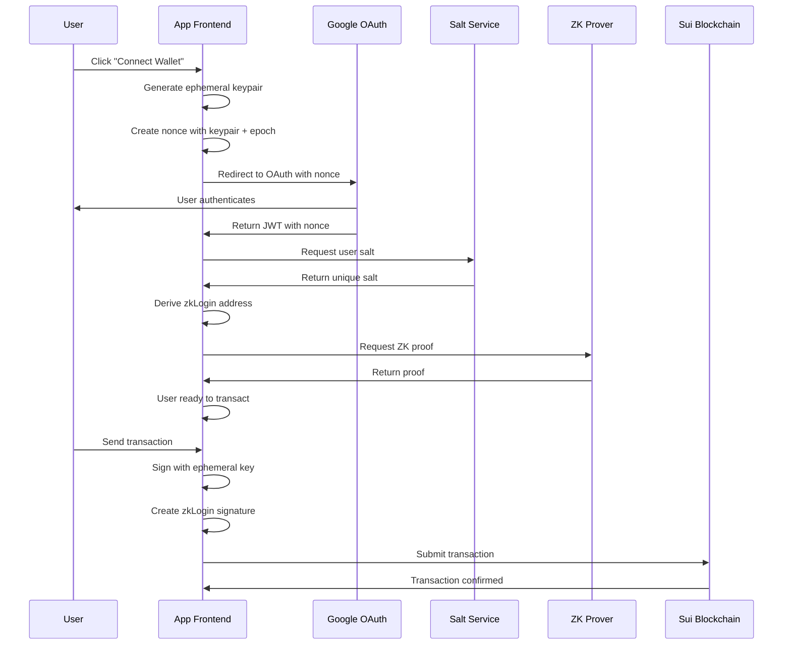

# Sui zkLogin Boilerplate

A comprehensive React + TypeScript + TailwindCSS starter for building Web3 applications with Sui's zkLogin authentication.
This boilerplate demonstrates how to implement zero-knowledge login using OAuth providers (Google) while maintaining user privacy and security.


### Opinionated Implementation

This boilerplate represents an **opinionated implementation** of zkLogin authentication with carefully chosen architectural decisions:

- **Feature-Based Organization**: Each domain (auth, profile, transactions) is self-contained with its own services, state, and UI
- **Service Layer Pattern**: Business logic is separated from React components, making it testable and reusable
- **Atomic Design System**: UI components follow a consistent hierarchy (atoms → molecules → organisms)
- **Result Pattern**: Type-safe error handling without exceptions for better reliability
- **Provider Architecture**: Layered providers handle cross-cutting concerns (errors, notifications, auth)

This architecture is designed to **scale from prototype to production**, supporting:

- **Team Development**: Clear boundaries make it easy for multiple developers to work on different features
- **Feature Growth**: New features can be added without affecting existing code
- **Testing**: Services can be easily mocked and tested independently
- **Maintenance**: Clear separation of concerns makes debugging and updates straightforward

## 🚀 Quick Start

### Prerequisites

- Node.js 18+
- pnpm (recommended) or npm/yarn
- Google OAuth Client ID

### Installation & Setup

```bash
# Clone and install dependencies
git clone <repository-url>
cd sui-zklogin-boilerplate
pnpm install

# Set up environment variables
cp .env.example .env
```

**Configure your `.env` file** (only `VITE_GOOGLE_CLIENT_ID` is required):

```env
# Required: Get from Google Cloud Console
VITE_GOOGLE_CLIENT_ID=your_google_client_id

# Optional: All other values have smart defaults
# VITE_REDIRECT_URL=http://localhost:5173/auth/callback  # Auto-generated
# VITE_ZK_PROVER_URL=https://prover-dev.mystenlabs.com/v1  # Default
# VITE_SUI_RPC_URL=https://fullnode.devnet.sui.io:443  # Default
```

**The system automatically**:

- ✅ Generates redirect URLs based on your domain
- ✅ Uses sensible defaults for all optional configuration
- ✅ Validates configuration on startup with clear error messages

### Running the Application

```bash
pnpm dev
```

Open http://localhost:5173 and click **Connect Wallet** to start the zkLogin flow.

### Available Pages

- **Home** (`/`) - Landing page with wallet connection
- **Profile** (`/profile`) - User profile and account details
- **Test Transaction** (`/test_tx`) - Transaction testing interface
- **UI Gallery** (`/gallery`) - Component showcase and design system reference

## 🔐 Understanding zkLogin

### What is zkLogin?

zkLogin is a Sui primitive that enables users to authenticate and transact on the blockchain using familiar OAuth credentials (Google, Facebook, etc.) without compromising privacy. It combines:

- **OAuth Authentication**: Users sign in with their existing social accounts
- **Zero-Knowledge Proofs**: Prove identity without revealing sensitive information
- **Ephemeral Keys**: Temporary keys for transaction signing (no persistent private keys to manage)
- **User Salt**: A secret value that unlinks OAuth identity from blockchain address

### The zkLogin Process Overview



### Key Components

1. **Ephemeral Keypair**: Temporary Ed25519 keypair for transaction signing
2. **JWT Token**: OAuth provider's signed token containing user identity
3. **User Salt**: 16-byte secret that unlinks OAuth identity from blockchain address
4. **ZK Proof**: Cryptographic proof that validates the OAuth credential without revealing it
5. **zkLogin Address**: Sui address derived from JWT + salt (not from a public key)

## 🔄 zkLogin Flow - Step by Step

Here's exactly what happens when a user interacts with the zkLogin system:

### **On First Load...**

- Store initializes with empty state: `{ account: null, decodedJwt: null, salt: null, isRestoring: false }`
- App checks for existing session data in cookies
- If found, attempts to restore zkLogin session for transaction signing
- On refresh, session data is restored: `{ ephemeralKeypair: "restored", maxEpoch: 68, randomness: "99429201407160918430468735605230118179", salt: "91936285553024866288626620632023329301", proof: "restored", jwtToken: "1008 chars", address: "0x25c20bb26a53506ba81b6c0c88ccd18c80e37735c3950c07033e34dd4ac73411" }`

### **When User Clicks "Connect Wallet"...**

**Step 1: Generate Ephemeral Keypair**

- We generate a temporary Ed25519 keypair: `{ publicKey: "HBEEhaQ42KeDwxyXQk8Rtf/t24fHVK4Q3kRijneyFmg=", privateKey: "70 bytes" }`
- This keypair will be used to sign transactions (not for authentication)
- Store the private key in session cookies: `zk_ephemeral_keypair`

**Step 2: Get Current Sui Epoch**

- We call `suiClient.getLatestSuiSystemState()` to get current epoch
- Set keypair validity to 2 epochs from now: `maxEpoch = 68` (current: 66)
- Store in session cookies: `zk_max_epoch`

**Step 3: Generate Randomness**

- We generate cryptographically secure randomness: `randomness = "99429201407160918430468735605230118179"`
- This prevents replay attacks and ensures nonce uniqueness (38-bit value)
- Store in session cookies: `zk_jwt_randomness`

**Step 4: Create Nonce**

- We combine ephemeral public key + max epoch + randomness: `nonce = "Z2uvub4JLwoSi5g_oKqxSDNgNEA"`
- This nonce links the OAuth response to our specific ephemeral keypair
- Components: `{ publicKey: "HBEEhaQ42KeDwxyXQk8Rtf/t24fHVK4Q3kRijneyFmg=", maxEpoch: 68, randomness: "99429201407160918430468735605230118179" }`

**Step 5: Redirect to Google OAuth**

- We build Google OAuth URL with nonce: `https://accounts.google.com/o/oauth2/v2/auth?client_id=YOUR_CLIENT_ID.apps.googleusercontent.com&redirect_uri=http%3A%2F%2Flocalhost%3A5173%2Fauth%2Fcallback&response_type=id_token&scope=openid+email&nonce=Z2uvub4JLwoSi5g_oKqxSDNgNEA&state=%252F`
- User is redirected to Google for authentication
- Google will include our nonce in the JWT response

### **When Google Redirects Back...**

**Step 6: Decode JWT Token**

- We receive JWT from Google: `{ iss: "https://accounts.google.com", sub: "184318064133009290952", aud: "YOUR_CLIENT_ID.apps.googleusercontent.com", exp: 1758464324, iat: 1758460724, nonce: "Z2uvub4JLwoSi5g_oKqxSDNgNEA", email: "user@example.com" }`
- We decode and validate the JWT contains our nonce (1008 characters total)
- Store JWT in session cookies: `zk_jwt_token`

**Step 7: Get or Create User Salt**

- We call salt service to get user's salt: `salt = await saltService.getOrCreateSalt(jwtPayload)`
- Retrieved existing salt: `salt = "91936285553024866288626620632023329301"` (38 digits, hex: `452a48d71ab12d761d89147dfe6e6a15`)
- Store in persistent cookies: `zk_user_salt` (30-day expiration)

**Step 8: Derive zkLogin Address**

- We combine JWT + salt to create address: `address = jwtToAddress(jwtToken, salt)`
- This creates a unique Sui address: `0x25c20bb26a53506ba81b6c0c88ccd18c80e37735c3950c07033e34dd4ac73411`
- Store in session cookies: `zk_user_address`

**Step 9: Generate ZK Proof**

- We call ZK prover service with JWT + ephemeral key + salt: `POST https://prover-dev.mystenlabs.com/v1 { jwt, extendedEphemeralPublicKey: "ABwRBIWkONing8Mcl0JPEbX/7duHx1SuEN5EYo53shZo", maxEpoch: 68, jwtRandomness: "99429201407160918430468735605230118179", salt: "91936285553024866288626620632023329301" }`
- Prover returns ZK proof: `{ proofPoints: [...], issBase64Details: [...], headerBase64: [...] }` (909 characters)
- Store proof in session cookies: `zk_proof_data`

### **When User Wants to Send a Transaction...**

**Step 10: Restore Session Data**

- We restore ephemeral keypair from cookies: `ephemeralKeypair = Ed25519Keypair.fromSecretKey(privateKey)`
- We restore ZK proof from cookies: `proof = JSON.parse(proofData)` (contains `proofPoints`, `issBase64Details`, `headerBase64`)
- We restore JWT and salt: `jwtToken = "1008 chars", salt = "91936285553024866288626620632023329301"`
- All session data successfully restored: `{ ephemeralKeypair: "restored", maxEpoch: 68, randomness: "99429201407160918430468735605230118179", salt: "91936285553024866288626620632023329301", proof: "restored", jwtToken: "1008 chars", address: "0x25c20bb26a53506ba81b6c0c88ccd18c80e37735c3950c07033e34dd4ac73411" }`

**Step 11: Create Signature Function**

- We create a function that combines ephemeral signature with ZK proof:
  ```typescript
  getSignature = userSignature => {
    const addressSeed = genAddressSeed(
      BigInt('91936285553024866288626620632023329301'),
      'sub',
      '184318064133009290952',
      'YOUR_CLIENT_ID.apps.googleusercontent.com'
    );
    return getZkLoginSignature({
      inputs: { ...proof, addressSeed },
      maxEpoch: 68,
      userSignature,
    });
  };
  ```

**Step 12: Sign Transaction**

- User creates transaction: `txb = new Transaction()`
- We sign with ephemeral keypair: `{ bytes, signature } = await txb.sign({ signer: ephemeralKeypair })`
- We create zkLogin signature: `zkLoginSignature = getSignature(signature)`
- We submit to Sui: `client.executeTransactionBlock({ transactionBlock: bytes, signature: zkLoginSignature })`

### **What We Store Where...**

**Session Cookies (expire when browser closes):**

- `zk_ephemeral_keypair` → `"70 bytes private key"` (Ed25519 private key for signing)
- `zk_max_epoch` → `"68"` (When keypair expires - 2 epochs from current)
- `zk_jwt_randomness` → `"99429201407160918430468735605230118179"` (Randomness for nonce)
- `zk_jwt_token` → `"1008 character JWT"` (JWT from Google with user identity)
- `zk_proof_data` → `"{ proofPoints: [...], issBase64Details: [...], headerBase64: [...] }"` (ZK proof from prover)
- `zk_user_address` → `"0x25c20bb26a53506ba81b6c0c88ccd18c80e37735c3950c07033e34dd4ac73411"` (Derived Sui address)

**Persistent Cookies (30-day expiration):**

- `zk_user_salt` → `"91936285553024866288626620632023329301"` (User's salt for address consistency)

**Store State (for UI):**

- `account` → `{ address: "0x25c20bb26a53506ba81b6c0c88ccd18c80e37735c3950c07033e34dd4ac73411" }`
- `decodedJwt` → `{ iss: "https://accounts.google.com", sub: "184318064133009290952", email: "user@example.com", ... }`
- `salt` → `"91936285553024866288626620632023329301"` (User's salt for debugging)
- `isRestoring` → `false` (Loading state)

### **Why This Design?**

- **Privacy**: Salt unlinks Google identity from blockchain address
- **Security**: Ephemeral keys expire, ZK proofs don't reveal credentials
- **Consistency**: Same salt + JWT = same address across devices
- **Simplicity**: Users just click "Connect" - no wallet setup needed

## 🏗️ Architecture Overview

This project follows a **Feature-Based + Atomic Design + Service Layer** pattern that provides:

- **Modularity**: Self-contained feature modules
- **Scalability**: Easy to add new features without affecting existing ones
- **Maintainability**: Clear separation of concerns
- **Testability**: Services can be easily mocked and tested
- **Reusability**: Shared components and utilities

### Key Features

- ✅ **zkLogin Authentication**: Zero-knowledge login using Google OAuth
- ✅ **Transaction Signing**: Complete zkLogin transaction flow
- ✅ **Session Management**: Cross-tab synchronization and persistence
- ✅ **Error Handling**: Comprehensive error management system
- ✅ **Modern UI**: Atomic design with TailwindCSS
- ✅ **Type Safety**: Full TypeScript support with strict typing

## 🔄 zkLogin Implementation

### Authentication Flow

The authentication process follows these steps:

1. **Ephemeral Key Generation**: Create temporary Ed25519 keypair
2. **Nonce Creation**: Generate nonce using ephemeral public key, max epoch, and randomness
3. **OAuth Redirect**: Send user to Google with nonce in state
4. **JWT Processing**: Decode and validate returned JWT token
5. **Salt Management**: Get or create user-specific salt
6. **Address Derivation**: Calculate zkLogin address from JWT + salt
7. **ZK Proof Generation**: Request proof from prover service
8. **Session Storage**: Store ephemeral data in secure cookies

### Data Storage Strategy

#### Session Cookies (Expire when browser closes)

- `zk_ephemeral_keypair`: Ed25519 private key for signing
- `zk_max_epoch`: Maximum epoch for key validity
- `zk_jwt_randomness`: Randomness used in nonce
- `zk_jwt_token`: OAuth JWT token
- `zk_proof_data`: ZK proof for verification
- `zk_user_address`: Derived zkLogin address

#### Persistent Cookies (30-day expiration)

- `zk_user_salt`: User salt for address derivation

### Cross-Tab Synchronization

The application uses a custom storage system that:

- Stores data in secure cookies
- Triggers `storage` events for cross-tab updates
- Maintains session consistency across browser tabs

## 🛠️ Usage Examples

### Creating Pages with zkLogin

To create a new page that uses zkLogin authentication:

```typescript
import { useZkLogin } from "../state/ZkLoginProvider";

export default function MyNewPage() {
  const { account, ensureZkSession, client } = useZkLogin();

  // Check if user is authenticated
  if (!account?.address) {
    return <div>Please sign in to access this page</div>;
  }

  // Use the zkLogin session for transactions
  const handleTransaction = async () => {
    const session = await ensureZkSession();
    if (!session) return;

    // Create and sign transaction
    const txb = new Transaction();
    txb.setSender(session.address);
    // ... add transaction logic

    const { bytes, signature } = await txb.sign({
      client,
      signer: session.ephemeralKeypair,
    });

    const zkLoginSignature = session.getSignature(signature);

    await client.executeTransactionBlock({
      transactionBlock: bytes,
      signature: zkLoginSignature,
    });
  };

  return (
    <div>
      <h1>My New Page</h1>
      <button onClick={handleTransaction}>Send Transaction</button>
    </div>
  );
}
```

### Available zkLogin Methods

- `account`: Current user account with address
- `decodedJwt`: Decoded JWT payload with user info
- `ensureZkSession()`: Get or create zkLogin session for transactions
- `loginWithProvider()`: Initiate OAuth login
- `logout()`: Clear session and sign out
- `clearSalt()`: Generate new salt (creates new address)

## 🔮 Production Considerations

### Custom Salt Service

For production deployments, consider implementing a custom salt service to provide stable addresses across devices:

- **Same OAuth account** + **same salt service** = **same Sui address**
- Users get consistent addresses across devices
- Salt can be rotated for security without changing address
- Backup/recovery mechanisms can be implemented

### Security Best Practices

1. **JWT Validation**: Always verify JWT signatures server-side
2. **Rate Limiting**: Implement rate limiting on salt requests
3. **Audit Logging**: Log salt access for security monitoring
4. **Encryption**: Encrypt salt data at rest
5. **Access Control**: Implement proper authentication for salt service

## 🔧 Configuration

### Environment Variables

```env
# Required: Get from Google Cloud Console
VITE_GOOGLE_CLIENT_ID=your_google_client_id

# Optional: All other values have smart defaults
# VITE_REDIRECT_URL=http://localhost:5173/auth/callback  # Auto-generated
# VITE_ZK_PROVER_URL=https://prover-dev.mystenlabs.com/v1  # Default
# VITE_SUI_RPC_URL=https://fullnode.devnet.sui.io:443  # Default
```

### Quick Setup

1. **Copy environment template**:

   ```bash
   cp .env.example .env
   ```

2. **Configure Google OAuth**:
   - Go to [Google Cloud Console](https://console.cloud.google.com/)
   - Create a new project or select existing
   - Enable Google+ API
   - Create OAuth 2.0 credentials
   - Add authorized redirect URI: `http://localhost:5173/auth/callback` (or your domain)
   - Copy Client ID to `.env` file

3. **Start development**:
   ```bash
   pnpm dev
   ```

The system will automatically:

- Generate redirect URLs based on your domain
- Use sensible defaults for all optional configuration
- Validate configuration on startup

## 📚 Additional Resources

- [Sui zkLogin Documentation](https://docs.sui.io/guides/developer/cryptography/zklogin)
- [Sui TypeScript SDK](https://sdk.mystenlabs.com/typescript)
- [OAuth 2.0 Specification](https://tools.ietf.org/html/rfc6749)
- [OpenID Connect](https://openid.net/connect/)

## 🤝 Contributing

1. Fork the repository
2. Create a feature branch
3. Make your changes
4. Add tests if applicable
5. Submit a pull request

## 📄 License

This project is licensed under the MIT License - see the LICENSE file for details.
