# Sui zkLogin Boilerplate

A comprehensive React + TypeScript + TailwindCSS starter for building Web3 applications with Sui's zkLogin authentication. This boilerplate demonstrates how to implement zero-knowledge login using OAuth providers (Google) while maintaining user privacy and security.

## 🚀 Quick Start

### Prerequisites

- Node.js 18+
- pnpm (recommended) or npm/yarn
- Google OAuth Client ID

### Installation & Setup

```bash
# Clone and install dependencies
git clone <repository-url>
cd sui-zklogin-boilerplate
pnpm install

# Set up environment variables
cp .env.example .env
```

**Configure your `.env` file** (only `VITE_GOOGLE_CLIENT_ID` is required):

```env
# Required: Get from Google Cloud Console
VITE_GOOGLE_CLIENT_ID=your_google_client_id

# Optional: All other values have smart defaults
# VITE_REDIRECT_URL=http://localhost:5173/auth/callback  # Auto-generated
# VITE_ZK_PROVER_URL=https://prover-dev.mystenlabs.com/v1  # Default
# VITE_SUI_RPC_URL=https://fullnode.devnet.sui.io:443  # Default
```

**The system automatically**:

- ✅ Generates redirect URLs based on your domain
- ✅ Uses sensible defaults for all optional configuration
- ✅ Validates configuration on startup with clear error messages

### Running the Application

```bash
pnpm dev
```

Open http://localhost:5173 and click **Connect Wallet** to start the zkLogin flow.

### Available Pages

- **Home** (`/`) - Landing page with wallet connection
- **Profile** (`/profile`) - User profile and account details
- **Test Transaction** (`/test_tx`) - Transaction testing interface
- **UI Gallery** (`/gallery`) - Component showcase and design system reference

## 🔐 Understanding zkLogin

### What is zkLogin?

zkLogin is a Sui primitive that enables users to authenticate and transact on the blockchain using familiar OAuth credentials (Google, Facebook, etc.) without compromising privacy. It combines:

- **OAuth Authentication**: Users sign in with their existing social accounts
- **Zero-Knowledge Proofs**: Prove identity without revealing sensitive information
- **Ephemeral Keys**: Temporary keys for transaction signing (no persistent private keys to manage)
- **User Salt**: A secret value that unlinks OAuth identity from blockchain address

### The zkLogin Process Overview


### Key Components

1. **Ephemeral Keypair**: Temporary Ed25519 keypair for transaction signing
2. **JWT Token**: OAuth provider's signed token containing user identity
3. **User Salt**: 16-byte secret that unlinks OAuth identity from blockchain address
4. **ZK Proof**: Cryptographic proof that validates the OAuth credential without revealing it
5. **zkLogin Address**: Sui address derived from JWT + salt (not from a public key)

## 🔄 zkLogin Flow - Step by Step

Here's exactly what happens when a user interacts with the zkLogin system:

### **On First Load...**

- Store initializes with empty state: `{ account: null, decodedJwt: null, salt: null, isRestoring: false }`
- App checks for existing session data in cookies
- If found, attempts to restore zkLogin session for transaction signing
- On refresh, session data is restored: `{ ephemeralKeypair: "restored", maxEpoch: 68, randomness: "99429201407160918430468735605230118179", salt: "91936285553024866288626620632023329301", proof: "restored", jwtToken: "1008 chars", address: "0x25c20bb26a53506ba81b6c0c88ccd18c80e37735c3950c07033e34dd4ac73411" }`

### **When User Clicks "Connect Wallet"...**

**Step 1: Generate Ephemeral Keypair**

- We generate a temporary Ed25519 keypair: `{ publicKey: "HBEEhaQ42KeDwxyXQk8Rtf/t24fHVK4Q3kRijneyFmg=", privateKey: "70 bytes" }`
- This keypair will be used to sign transactions (not for authentication)
- Store the private key in session cookies: `zk_ephemeral_keypair`

**Step 2: Get Current Sui Epoch**

- We call `suiClient.getLatestSuiSystemState()` to get current epoch
- Set keypair validity to 2 epochs from now: `maxEpoch = 68` (current: 66)
- Store in session cookies: `zk_max_epoch`

**Step 3: Generate Randomness**

- We generate cryptographically secure randomness: `randomness = "99429201407160918430468735605230118179"`
- This prevents replay attacks and ensures nonce uniqueness (38-bit value)
- Store in session cookies: `zk_jwt_randomness`

**Step 4: Create Nonce**

- We combine ephemeral public key + max epoch + randomness: `nonce = "Z2uvub4JLwoSi5g_oKqxSDNgNEA"`
- This nonce links the OAuth response to our specific ephemeral keypair
- Components: `{ publicKey: "HBEEhaQ42KeDwxyXQk8Rtf/t24fHVK4Q3kRijneyFmg=", maxEpoch: 68, randomness: "99429201407160918430468735605230118179" }`

**Step 5: Redirect to Google OAuth**

- We build Google OAuth URL with nonce: `https://accounts.google.com/o/oauth2/v2/auth?client_id=YOUR_CLIENT_ID.apps.googleusercontent.com&redirect_uri=http%3A%2F%2Flocalhost%3A5173%2Fauth%2Fcallback&response_type=id_token&scope=openid+email&nonce=Z2uvub4JLwoSi5g_oKqxSDNgNEA&state=%252F`
- User is redirected to Google for authentication
- Google will include our nonce in the JWT response

### **When Google Redirects Back...**

**Step 6: Decode JWT Token**

- We receive JWT from Google: `{ iss: "https://accounts.google.com", sub: "184318064133009290952", aud: "YOUR_CLIENT_ID.apps.googleusercontent.com", exp: 1758464324, iat: 1758460724, nonce: "Z2uvub4JLwoSi5g_oKqxSDNgNEA", email: "user@example.com" }`
- We decode and validate the JWT contains our nonce (1008 characters total)
- Store JWT in session cookies: `zk_jwt_token`

**Step 7: Get or Create User Salt**

- We call salt service to get user's salt: `salt = await saltService.getOrCreateSalt(jwtPayload)`
- Retrieved existing salt: `salt = "91936285553024866288626620632023329301"` (38 digits, hex: `452a48d71ab12d761d89147dfe6e6a15`)
- Store in persistent cookies: `zk_user_salt` (30-day expiration)

**Step 8: Derive zkLogin Address**

- We combine JWT + salt to create address: `address = jwtToAddress(jwtToken, salt)`
- This creates a unique Sui address: `0x25c20bb26a53506ba81b6c0c88ccd18c80e37735c3950c07033e34dd4ac73411`
- Store in session cookies: `zk_user_address`

**Step 9: Generate ZK Proof**

- We call ZK prover service with JWT + ephemeral key + salt: `POST https://prover-dev.mystenlabs.com/v1 { jwt, extendedEphemeralPublicKey: "ABwRBIWkONing8Mcl0JPEbX/7duHx1SuEN5EYo53shZo", maxEpoch: 68, jwtRandomness: "99429201407160918430468735605230118179", salt: "91936285553024866288626620632023329301" }`
- Prover returns ZK proof: `{ proofPoints: [...], issBase64Details: [...], headerBase64: [...] }` (909 characters)
- Store proof in session cookies: `zk_proof_data`

### **When User Wants to Send a Transaction...**

**Step 10: Restore Session Data**

- We restore ephemeral keypair from cookies: `ephemeralKeypair = Ed25519Keypair.fromSecretKey(privateKey)`
- We restore ZK proof from cookies: `proof = JSON.parse(proofData)` (contains `proofPoints`, `issBase64Details`, `headerBase64`)
- We restore JWT and salt: `jwtToken = "1008 chars", salt = "91936285553024866288626620632023329301"`
- All session data successfully restored: `{ ephemeralKeypair: "restored", maxEpoch: 68, randomness: "99429201407160918430468735605230118179", salt: "91936285553024866288626620632023329301", proof: "restored", jwtToken: "1008 chars", address: "0x25c20bb26a53506ba81b6c0c88ccd18c80e37735c3950c07033e34dd4ac73411" }`

**Step 11: Create Signature Function**

- We create a function that combines ephemeral signature with ZK proof:
  ```typescript
  getSignature = userSignature => {
    const addressSeed = genAddressSeed(
      BigInt('91936285553024866288626620632023329301'),
      'sub',
      '184318064133009290952',
      'YOUR_CLIENT_ID.apps.googleusercontent.com'
    );
    return getZkLoginSignature({
      inputs: { ...proof, addressSeed },
      maxEpoch: 68,
      userSignature,
    });
  };
  ```

**Step 12: Sign Transaction**

- User creates transaction: `txb = new Transaction()`
- We sign with ephemeral keypair: `{ bytes, signature } = await txb.sign({ signer: ephemeralKeypair })`
- We create zkLogin signature: `zkLoginSignature = getSignature(signature)`
- We submit to Sui: `client.executeTransactionBlock({ transactionBlock: bytes, signature: zkLoginSignature })`

### **What We Store Where...**

**Session Cookies (expire when browser closes):**

- `zk_ephemeral_keypair` → `"70 bytes private key"` (Ed25519 private key for signing)
- `zk_max_epoch` → `"68"` (When keypair expires - 2 epochs from current)
- `zk_jwt_randomness` → `"99429201407160918430468735605230118179"` (Randomness for nonce)
- `zk_jwt_token` → `"1008 character JWT"` (JWT from Google with user identity)
- `zk_proof_data` → `"{ proofPoints: [...], issBase64Details: [...], headerBase64: [...] }"` (ZK proof from prover)
- `zk_user_address` → `"0x25c20bb26a53506ba81b6c0c88ccd18c80e37735c3950c07033e34dd4ac73411"` (Derived Sui address)

**Persistent Cookies (30-day expiration):**

- `zk_user_salt` → `"91936285553024866288626620632023329301"` (User's salt for address consistency)

**Store State (for UI):**

- `account` → `{ address: "0x25c20bb26a53506ba81b6c0c88ccd18c80e37735c3950c07033e34dd4ac73411" }`
- `decodedJwt` → `{ iss: "https://accounts.google.com", sub: "184318064133009290952", email: "user@example.com", ... }`
- `salt` → `"91936285553024866288626620632023329301"` (User's salt for debugging)
- `isRestoring` → `false` (Loading state)

### **Why This Design?**

- **Privacy**: Salt unlinks Google identity from blockchain address
- **Security**: Ephemeral keys expire, ZK proofs don't reveal credentials
- **Consistency**: Same salt + JWT = same address across devices
- **Simplicity**: Users just click "Connect" - no wallet setup needed

## 🏗️ Project Architecture

### File Structure

```
src/
├── app/                        # 🎯 Application Layer (App-specific components)
│   ├── components/             # App-level components
│   │   ├── Home.tsx            # Landing page component
│   │   ├── Navbar.tsx          # Navigation bar component
│   │   └── index.ts            # Barrel exports
│   ├── layouts/                # Layout components
│   │   ├── AppLayout.tsx       # Main application layout
│   │   └── index.ts            # Barrel exports
│   ├── providers/              # App-level providers
│   │   ├── ErrorBoundary.tsx   # Error boundary component
│   │   ├── NotificationProvider.tsx # Notification system
│   │   └── index.ts            # Barrel exports
│   └── index.ts                # Main app exports
├── features/                   # 🚀 Feature Modules (Domain-specific)
│   ├── auth/                   # Authentication feature
│   │   ├── hooks/              # Auth-specific hooks
│   │   │   ├── useCrossTabSync.ts # Cross-tab synchronization
│   │   │   ├── ZkLoginProvider.tsx # React Context provider
│   │   │   └── index.ts        # Barrel exports
│   │   ├── routes/             # Auth-specific routes
│   │   │   ├── AuthCallback.tsx # OAuth callback handler
│   │   │   └── index.ts        # Barrel exports
│   │   ├── services/           # Auth business logic
│   │   │   ├── zkLoginService.ts # Main zkLogin service
│   │   │   ├── saltService.ts  # Salt management service
│   │   │   └── index.ts        # Barrel exports
│   │   ├── store/              # Auth state management
│   │   │   ├── zkLoginStore.ts # Zustand store
│   │   │   └── index.ts        # Barrel exports
│   │   ├── types.ts            # Auth-specific types
│   │   └── index.ts            # Feature barrel exports
│   ├── profile/                # User profile feature
│   │   ├── routes/             # Profile routes
│   │   │   ├── Profile.tsx     # Profile page component
│   │   │   └── index.ts        # Barrel exports
│   │   └── index.ts            # Feature barrel exports
│   ├── transactions/           # Transaction feature
│   │   ├── routes/             # Transaction routes
│   │   │   ├── TestTx.tsx      # Transaction testing page
│   │   │   └── index.ts        # Barrel exports
│   │   ├── services/           # Transaction services
│   │   └── index.ts            # Feature barrel exports
│   └── gallery/                # UI component gallery feature
│       ├── routes/             # Gallery routes
│       │   ├── UIGallery.tsx   # Component showcase page
│       │   └── index.ts        # Barrel exports
│       └── index.ts            # Feature barrel exports
├── shared/                     # 🔧 Shared Utilities (Reusable across features)
│   ├── lib/                    # Core libraries
│   │   ├── errors.ts           # Error handling utilities
│   │   ├── http.ts             # HTTP client utilities
│   │   ├── result.ts           # Result type utilities
│   │   ├── sui/                # Sui blockchain utilities
│   │   │   └── client.ts       # Sui client configuration
│   │   └── index.ts            # Barrel exports
│   ├── ui/                     # Shared UI components (Atomic Design)
│   │   ├── atoms/              # Basic building blocks
│   │   │   ├── Avatar.tsx      # User avatar component
│   │   │   ├── Button.tsx      # Button component
│   │   │   ├── Icon.tsx        # Icon component
│   │   │   ├── Input.tsx       # Input component
│   │   │   ├── LoadingSpinner.tsx # Loading spinner
│   │   │   └── index.ts        # Barrel exports
│   │   ├── molecules/          # Simple combinations
│   │   │   ├── ConnectWalletButton.tsx # Wallet connection button
│   │   │   ├── DropdownMenu.tsx # Dropdown menu component
│   │   │   ├── NotificationItem.tsx # Notification item
│   │   │   └── index.ts        # Barrel exports
│   │   ├── organisms/          # Complex components
│   │   │   ├── UserWalletButton.tsx # User wallet display
│   │   │   ├── NotificationContainer.tsx # Notification system
│   │   │   └── index.ts        # Barrel exports
│   │   ├── README.md           # UI component guidelines
│   │   └── index.ts            # Main UI exports
│   ├── utils/                  # Utility functions
│   │   ├── cookieStorage.ts    # Cookie-based storage utilities
│   │   └── index.ts            # Barrel exports
│   └── index.ts                # Main shared exports
├── config/                     # ⚙️ Configuration Management
│   └── index.ts                # Centralized configuration with Zod validation
├── main.tsx                    # Application entry point
└── index.css                   # Global styles
```

### Architecture Layers

```mermaid
graph TB
    subgraph "🎯 Application Layer"
        A[App Components]
        B[App Layouts]
        C[App Providers]
        D[Feature Routes]
    end

    subgraph "🚀 Feature Modules"
        E[Auth Feature]
        F[Profile Feature]
        G[Transactions Feature]
        H[Feature Hooks]
        I[Feature Services]
        J[Feature Stores]
    end

    subgraph "🔧 Shared Layer"
        K[UI Components<br/>Atomic Design]
        L[Core Libraries]
        M[Utilities]
        N[Configuration]
    end

    subgraph "🏢 Service Layer"
        O[ZkLoginService]
        P[SaltService]
        Q[Demo Salt Service]
        R[Backend Salt Service]
    end

    subgraph "🌐 Infrastructure Layer"
        S[Cookie Storage]
        T[Sui Client]
        U[External APIs]
        V[HTTP Client]
    end

    A --> E
    B --> E
    C --> E
    D --> E
    E --> H
    E --> I
    E --> J
    F --> H
    F --> I
    F --> J
    G --> H
    G --> I
    G --> J
    H --> O
    I --> O
    J --> O
    O --> P
    P --> Q
    P --> R
    O --> S
    O --> T
    O --> U
    O --> V
    K --> A
    L --> I
    M --> I
    N --> I
```



### Service-Oriented Data Flow


### Data Flow Architecture


## 🏢 Service Architecture

### Feature-Based Service Layer Pattern

This project follows a **Feature-Based Service Layer Pattern** that organizes business logic by domain features while maintaining clear separation of concerns:

#### **Feature Module Structure**

Each feature module (`features/*/`) contains its own service layer:

- **`services/`**: Business logic and external API interactions
- **`store/`**: State management (thin layer over services)
- **`hooks/`**: React integration and cross-cutting concerns
- **`routes/`**: Feature-specific UI components
- **`types.ts`**: Feature-specific type definitions

#### **ZkLoginService** - Authentication Business Logic

- **OAuth Flow Management**: Handles Google OAuth initiation and completion
- **Cryptographic Operations**: Manages ephemeral keypairs, nonce generation, address derivation
- **ZK Proof Generation**: Communicates with ZK prover service
- **Session Creation**: Creates zkLogin sessions for transaction signing
- **Error Handling**: Returns structured results instead of throwing exceptions
- **Configuration Integration**: Uses centralized config system with Zod validation

#### **SaltService** - Salt Management

- **Demo Implementation**: Client-side salt generation for development
- **Backend Implementation**: Production-ready backend salt service
- **Strategy Pattern**: Easy switching between implementations via configuration
- **Consistent API**: Same interface regardless of implementation
- **Dependency Injection**: Injected into ZkLoginService for testability

#### **Shared Services** - Cross-Feature Utilities

- **HTTP Client**: Centralized HTTP communication with error handling
- **Error Handling**: Structured error types and result patterns
- **Configuration**: Centralized config with validation and type safety
- **Sui Client**: Blockchain interaction utilities

#### **Benefits of Feature-Based Service Architecture**

- ✅ **Domain Separation**: Each feature owns its business logic
- ✅ **Scalability**: Easy to add new features without affecting existing ones
- ✅ **Testability**: Services can be easily mocked and tested independently
- ✅ **Reusability**: Services can be used outside of React components
- ✅ **Maintainability**: Clear boundaries and single responsibility
- ✅ **Configuration**: Environment-based service selection with type safety
- ✅ **Dependency Injection**: Services can be easily swapped for testing

## 🚨 Error Handling Architecture

### Structured Error System

This project implements a comprehensive error handling system that provides type-safe, consistent error management across all layers:

#### **AppError Type System**

```typescript
// Centralized error types
export type AppErrorKind =
  | 'Network'
  | 'Timeout'
  | 'Unauthorized'
  | 'Forbidden'
  | 'NotFound'
  | 'RateLimited'
  | 'Validation'
  | 'Server'
  | 'Unknown'
  | 'ZkLogin'
  | 'OAuth'
  | 'SaltService'
  | 'JWT';

export type AppError = {
  kind: AppErrorKind;
  message: string; // user-safe message
  status?: number; // http status
  cause?: unknown; // raw error for logging
  details?: unknown; // field errors, etc.
};
```

#### **Result Pattern**

The application uses a `Result<T, E>` type for handling success/failure cases without throwing exceptions:

```typescript
// Service methods return Result types
async method(): Promise<Result<DataType, AppError>> {
  try {
    // Business logic
    return ok(data);
  } catch (error) {
    return err(createAppError('Service', 'Operation failed', { cause: error }));
  }
}

// Usage in components
const result = await service.method();
if (result.ok) {
  // Handle success: result.data
} else {
  // Handle error: result.error
}
```

#### **Error Boundary Integration**

```typescript
// App-level error boundary with structured error handling
<ErrorBoundary
  onError={(error, errorInfo) => {
    // Convert to AppError for consistent handling
    const appError = toAppError(error);
    // Send to error reporting service
    console.error('Application error:', appError, errorInfo);
  }}
>
  <App />
</ErrorBoundary>
```

#### **Notification System Integration**

```typescript
// Automatic error display through notification system
const { showError, showSuccess } = useNotifications();

// Services automatically convert errors to user-friendly messages
const result = await service.method();
if (!result.ok) {
  showError(result.error); // Displays user-friendly error message
}
```

## 🎭 Provider Architecture

### Layered Provider System

The application uses a carefully orchestrated provider hierarchy that provides cross-cutting concerns:

#### **Provider Hierarchy** (from main.tsx)

```typescript
<ErrorBoundary>           // 1. Error boundary (outermost)
  <NotificationProvider>  // 2. Notification system
    <ZkLoginProvider>     // 3. Authentication state
      <RouterProvider />  // 4. Routing (innermost)
    </ZkLoginProvider>
  </NotificationProvider>
</ErrorBoundary>
```

#### **ErrorBoundary Provider**

- **Purpose**: Catches JavaScript errors anywhere in the component tree
- **Features**:
  - Graceful error fallback UI
  - Development error details
  - Error reporting integration
  - Recovery mechanisms

```typescript
<ErrorBoundary
  onError={(error, errorInfo) => {
    // Production error reporting
    console.error('Application error:', error, errorInfo);
  }}
  fallback={(error, resetError) => (
    <CustomErrorFallback error={error} onReset={resetError} />
  )}
>
  {children}
</ErrorBoundary>
```

#### **NotificationProvider**

- **Purpose**: Centralized notification system for user feedback
- **Features**:
  - Toast notifications
  - Error display integration
  - Success/warning/info messages
  - Auto-dismiss functionality

```typescript
const { showError, showSuccess, showWarning, showInfo } = useNotifications();

// Automatic error handling
showError(appError); // Displays user-friendly error message

// Success feedback
showSuccess('Login Successful', 'Welcome back!');
```

#### **ZkLoginProvider**

- **Purpose**: Authentication state management
- **Features**:
  - OAuth flow management
  - Session restoration
  - Cross-tab synchronization
  - Transaction signing capabilities

```typescript
const { account, loginWithProvider, ensureZkSession } = useZkLogin();
```

#### **Provider Benefits**

- ✅ **Separation of Concerns**: Each provider handles specific functionality
- ✅ **Error Isolation**: Errors in one provider don't crash others
- ✅ **Consistent UX**: Centralized error handling and notifications
- ✅ **Development Experience**: Clear error boundaries and debugging
- ✅ **Production Ready**: Graceful error recovery and reporting

### Service Configuration

```typescript
// Centralized configuration with Zod validation
import { getConfig } from '@/config';

const configResult = getConfig();
if (configResult.ok) {
  const config = configResult.data;
  // Type-safe access to all configuration values
  const zkLoginService = createZkLoginService({
    googleClientId: config.googleClientId,
    redirectUrl: config.redirectUrl,
    proverUrl: config.proverUrl,
    useBackendSaltService: config.useBackendSaltService,
    saltServiceUrl: config.saltServiceUrl,
    suiRpcUrl: config.suiRpcUrl,
  });
} else {
  // Handle configuration errors gracefully
  console.error('Configuration error:', configResult.error.message);
}
```

#### **Configuration Features**

- **Type Safety**: Full TypeScript support with Zod validation
- **Runtime Validation**: Configuration errors caught at startup
- **Dynamic URLs**: Redirect URLs generated from current domain
- **Environment Detection**: Automatic development/production detection
- **Error Handling**: Structured error reporting for missing configuration

## 🔄 zkLogin Implementation Details

### 1. Authentication Flow

The authentication process follows these steps:

1. **Ephemeral Key Generation**: Create temporary Ed25519 keypair
2. **Nonce Creation**: Generate nonce using ephemeral public key, max epoch, and randomness
3. **OAuth Redirect**: Send user to Google with nonce in state
4. **JWT Processing**: Decode and validate returned JWT token
5. **Salt Management**: Get or create user-specific salt
6. **Address Derivation**: Calculate zkLogin address from JWT + salt
7. **ZK Proof Generation**: Request proof from prover service
8. **Session Storage**: Store ephemeral data in secure cookies

### 2. Data Storage Strategy

#### Session Cookies (Expire when browser closes)

- `zk_ephemeral_keypair`: Ed25519 private key for signing
- `zk_max_epoch`: Maximum epoch for key validity
- `zk_jwt_randomness`: Randomness used in nonce
- `zk_jwt_token`: OAuth JWT token
- `zk_proof_data`: ZK proof for verification
- `zk_user_address`: Derived zkLogin address

#### Persistent Cookies (30-day expiration)

- `zk_user_salt`: User salt for address derivation

### 3. Cross-Tab Synchronization

The application uses a custom storage system that:

- Stores data in secure cookies
- Triggers `storage` events for cross-tab updates
- Maintains session consistency across browser tabs

## 🛠️ Building New Features

### Creating Pages with zkLogin

To create a new page that uses zkLogin authentication:

```typescript
import { useZkLogin } from "../state/ZkLoginProvider";

export default function MyNewPage() {
  const { account, ensureZkSession, client } = useZkLogin();

  // Check if user is authenticated
  if (!account?.address) {
    return <div>Please sign in to access this page</div>;
  }

  // Use the zkLogin session for transactions
  const handleTransaction = async () => {
    const session = await ensureZkSession();
    if (!session) return;

    // Create and sign transaction
    const txb = new Transaction();
    txb.setSender(session.address);
    // ... add transaction logic

    const { bytes, signature } = await txb.sign({
      client,
      signer: session.ephemeralKeypair,
    });

    const zkLoginSignature = session.getSignature(signature);

    await client.executeTransactionBlock({
      transactionBlock: bytes,
      signature: zkLoginSignature,
    });
  };

  return (
    <div>
      <h1>My New Page</h1>
      <button onClick={handleTransaction}>Send Transaction</button>
    </div>
  );
}
```

### Available zkLogin Methods

- `account`: Current user account with address
- `decodedJwt`: Decoded JWT payload with user info
- `ensureZkSession()`: Get or create zkLogin session for transactions
- `loginWithProvider()`: Initiate OAuth login
- `logout()`: Clear session and sign out
- `clearSalt()`: Generate new salt (creates new address)

## 🔮 Future Integration: Custom Salt Service

### Stable Addresses Across Devices

To provide stable addresses across devices, implement a custom salt service:

#### Required Data Storage

```typescript
interface SaltServiceData {
  // User identification
  sub: string; // OAuth subject ID
  iss: string; // OAuth issuer (e.g., Google)
  aud: string; // OAuth audience (your app)

  // Salt management
  salt: string; // 16-byte user salt
  createdAt: number; // Creation timestamp
  lastUsed: number; // Last access timestamp

  // Security
  saltHash: string; // Hash of salt for verification
  rotationCount: number; // Number of salt rotations
}
```

#### Salt Service Implementation

```typescript
// Backend salt service endpoint
app.post('/api/salt', async (req, res) => {
  const { jwt } = req.body;
  const decoded = jwtDecode(jwt);

  // Verify JWT signature
  const isValid = await verifyJWT(jwt);
  if (!isValid) {
    return res.status(401).json({ error: 'Invalid JWT' });
  }

  // Generate or retrieve salt
  const salt = await getOrCreateSalt({
    sub: decoded.sub,
    iss: decoded.iss,
    aud: decoded.aud,
  });

  res.json({ salt });
});
```

#### Frontend Integration

```typescript
// Update getOrCreateSalt in zkLoginStore.ts
getOrCreateSalt: async (decoded: JwtPayload): Promise<string> => {
  const key = 'zk_user_salt';
  let salt = persistentCookieStorage.getItem(key);

  if (!salt) {
    // Call your custom salt service
    const response = await fetch('/api/salt', {
      method: 'POST',
      headers: { 'Content-Type': 'application/json' },
      body: JSON.stringify({ jwt: idToken }),
    });

    const { salt: serverSalt } = await response.json();
    salt = serverSalt;
    persistentCookieStorage.setItem(key, salt);
  }

  return salt;
};
```

### Address Stability

With a custom salt service:

- **Same OAuth account** + **same salt service** = **same Sui address**
- Users get consistent addresses across devices
- Salt can be rotated for security without changing address
- Backup/recovery mechanisms can be implemented

### Security Considerations

1. **JWT Validation**: Always verify JWT signatures server-side
2. **Rate Limiting**: Implement rate limiting on salt requests
3. **Audit Logging**: Log salt access for security monitoring
4. **Encryption**: Encrypt salt data at rest
5. **Access Control**: Implement proper authentication for salt service

## 🔧 Configuration & Environment

### Centralized Configuration System

This project uses a **centralized configuration system** with Zod validation that provides:

- ✅ **Type-safe configuration** with runtime validation
- ✅ **Dynamic redirect URL generation** (works across environments)
- ✅ **Environment variable validation** with clear error messages
- ✅ **Default values** for optional configuration
- ✅ **Configuration summary** for debugging
- ✅ **Result-based error handling** for graceful failures

### Configuration Features

#### **Dynamic Redirect URL Generation**

The system automatically generates redirect URLs based on the current domain:

- **Development**: `http://localhost:5173/auth/callback`
- **Production**: `https://yourapp.com/auth/callback`
- **Custom**: Override with `VITE_REDIRECT_URL` environment variable

#### **Configuration Validation**

All configuration is validated at startup with descriptive error messages:

```typescript
// Example validation error
Configuration validation failed:
googleClientId: Google Client ID is required
saltServiceUrl: Invalid salt service URL
```

#### **Configuration Access**

```typescript
import { getConfig } from '@/config';

// Type-safe access with error handling
const configResult = getConfig();
if (configResult.ok) {
  const config = configResult.data;
  console.log(config.googleClientId);
  console.log(config.redirectUrl); // Auto-generated or from env

  // Environment checks
  if (config.isDevelopment) {
    console.log('Running in development mode');
  }
} else {
  console.error('Configuration error:', configResult.error.message);
}
```

#### **Configuration Validation Helpers**

```typescript
import { validateProductionConfig, getConfigSummary } from '@/config';

// Validate production readiness
const validation = validateProductionConfig();
if (!validation.isValid) {
  console.error('Configuration issues:', validation.issues);
}

// Get safe configuration summary for debugging
const summary = getConfigSummary();
console.log('Configuration:', summary);
```

### Environment Variables

```env
# ============================================================================
# REQUIRED CONFIGURATION
# ============================================================================

# Google OAuth Configuration
VITE_GOOGLE_CLIENT_ID=your_google_client_id_here

# ============================================================================
# OPTIONAL CONFIGURATION (with defaults)
# ============================================================================

# Redirect URL (auto-generated if not provided)
# VITE_REDIRECT_URL=http://localhost:5173/auth/callback

# ZK Prover Service (default: https://prover-dev.mystenlabs.com/v1)
# VITE_ZK_PROVER_URL=https://prover-dev.mystenlabs.com/v1

# Sui Network (default: https://fullnode.devnet.sui.io:443)
# VITE_SUI_RPC_URL=https://fullnode.devnet.sui.io:443

# Explorer URLs (optional)
# VITE_EXPLORER_OBJECT_BASE_URL=https://suiscan.xyz/devnet/object

# ============================================================================
# PRODUCTION CONFIGURATION
# ============================================================================

# Salt Service (for production)
# VITE_USE_BACKEND_SALT_SERVICE=true
# VITE_SALT_SERVICE_URL=https://api.yourapp.com/salt

# Logging (optional)
# VITE_LOG_LEVEL=info

# ============================================================================
# DEVELOPMENT CONFIGURATION
# ============================================================================

# Development mode is automatically detected
# No additional configuration needed for local development
```

### Configuration Schema

The configuration system validates the following schema:

```typescript
interface Config {
  // OAuth Configuration
  googleClientId: string; // Required
  redirectUrl: string; // Auto-generated or from env

  // ZK Prover Service
  proverUrl: string; // Default: prover-dev.mystenlabs.com

  // Salt Service Configuration
  useBackendSaltService: boolean; // Default: false
  saltServiceUrl?: string; // Optional

  // Sui Blockchain Configuration
  suiRpcUrl: string; // Default: fullnode.devnet.sui.io

  // Explorer Configuration
  explorerObjectBaseUrl?: string; // Optional

  // Development Configuration
  isDevelopment: boolean; // Auto-detected
  logLevel: 'debug' | 'info' | 'warn' | 'error'; // Default: info
}
```

### Configuration Validation

The system provides built-in validation helpers:

```typescript
import { validateProductionConfig, getConfigSummary } from './config';

// Validate production readiness
const validation = validateProductionConfig();
if (!validation.isValid) {
  console.error('Configuration issues:', validation.issues);
}

// Get safe configuration summary for debugging
const summary = getConfigSummary();
console.log('Configuration:', summary);
```

### Quick Setup

1. **Copy environment template**:

   ```bash
   cp .env.example .env
   ```

2. **Configure Google OAuth**:
   - Go to [Google Cloud Console](https://console.cloud.google.com/)
   - Create a new project or select existing
   - Enable Google+ API
   - Create OAuth 2.0 credentials
   - Add authorized redirect URI: `http://localhost:5173/auth/callback` (or your domain)
   - Copy Client ID to `.env` file

3. **Start development**:
   ```bash
   npm run dev
   ```

The system will automatically:

- Generate redirect URLs based on your domain
- Use sensible defaults for all optional configuration
- Validate configuration on startup

## 🚨 Security Best Practices

### Current Implementation (Demo)

- ✅ Session cookies for ephemeral data
- ✅ Secure cookie settings
- ✅ Cross-tab synchronization
- ⚠️ Client-side salt generation (demo only)

### Production Recommendations

- 🔒 Move salt service to backend
- 🔒 Implement proper JWT validation
- 🔒 Use HTTPS in production
- 🔒 Add rate limiting
- 🔒 Implement audit logging
- 🔒 Consider salt rotation policies

## 📚 Additional Resources

- [Sui zkLogin Documentation](https://docs.sui.io/guides/developer/cryptography/zklogin)
- [Sui TypeScript SDK](https://sdk.mystenlabs.com/typescript)
- [OAuth 2.0 Specification](https://tools.ietf.org/html/rfc6749)
- [OpenID Connect](https://openid.net/connect/)

## 🤝 Contributing

1. Fork the repository
2. Create a feature branch
3. Make your changes
4. Add tests if applicable
5. Submit a pull request

## 🎨 Styling Guide for Maintainers

This section provides comprehensive guidelines for maintaining and extending the codebase while preserving consistency and architectural patterns.

### 🏗️ Architecture Overview

The project follows a **Feature-Based + Atomic Design + Service Layer** pattern:

```mermaid
graph TB
    subgraph "🎯 Application Layer"
        A[App Components]
        B[App Layouts]
        C[App Providers]
    end

    subgraph "🚀 Feature Modules"
        D[Feature Components]
        E[Feature Hooks]
        F[Feature Services]
        G[Feature Stores]
    end

    subgraph "🔧 Shared Layer"
        H[UI Components<br/>Atomic Design]
        I[Core Libraries]
        J[Utilities]
        K[Configuration]
    end

    subgraph "🏢 Service Layer"
        L[ZkLoginService]
        M[SaltService]
        N[HTTP Client]
    end

    subgraph "🌐 Infrastructure Layer"
        O[Cookie Storage]
        P[Sui Client]
        Q[External APIs]
    end

    A --> D
    B --> D
    C --> D
    D --> E
    E --> F
    F --> G
    F --> L
    L --> M
    L --> N
    H --> A
    I --> F
    J --> F
    K --> F
    L --> O
    L --> P
    L --> Q
```



### 📁 File Organization Patterns

#### **Feature Modules** (`src/features/*/`)

Each feature module follows a consistent structure:

- **Purpose**: Domain-specific functionality with clear boundaries
- **Pattern**: Self-contained modules with internal organization
- **Naming**: `{feature}/` (e.g., `auth/`, `profile/`, `transactions/`)
- **Structure**:
  ```
  features/auth/
  ├── hooks/           # React integration and cross-cutting concerns
  ├── routes/          # Feature-specific UI components
  ├── services/        # Business logic and external API interactions
  ├── store/           # State management (thin layer over services)
  ├── types.ts         # Feature-specific type definitions
  └── index.ts         # Feature barrel exports
  ```

#### **Service Layer** (`src/features/*/services/`)

- **Purpose**: Pure business logic and external API interactions
- **Pattern**: Class-based services with dependency injection
- **Naming**: `{feature}Service.ts` (e.g., `zkLoginService.ts`, `saltService.ts`)
- **Structure**:
  ```typescript
  export class FeatureService {
    constructor(config: FeatureConfig) {
      /* DI setup */
    }
    async methodName(): Promise<Result> {
      /* business logic */
    }
  }
  export function createFeatureService(): FeatureService {
    /* factory */
  }
  ```

#### **State Management** (`src/features/*/store/`)

- **Purpose**: Thin state management wrapper over services
- **Pattern**: Zustand store with custom storage
- **Naming**: `{feature}Store.ts` (e.g., `zkLoginStore.ts`)
- **Structure**:
  ```typescript
  export const useFeatureStore = create<FeatureState>()(
    persist(
      (set, get) => ({
        // State
        data: null,
        // Actions that delegate to services
        action: async () => {
          const { service } = get();
          const result = await service.method();
          if (result.success) set({ data: result.data });
        },
      }),
      { name: 'feature-storage', storage: createCustomStorage() }
    )
  );
  ```

#### **React Integration** (`src/features/*/hooks/`)

- **Purpose**: Bridge between React and state management
- **Pattern**: React Context + custom hook
- **Naming**: `{Feature}Provider.tsx` (e.g., `ZkLoginProvider.tsx`)
- **Structure**:

  ```typescript
  const FeatureCtx = createContext<FeatureContext | null>(null);

  export function FeatureProvider({ children }) {
    const store = useFeatureStore();
    const value = { ...store, client: sharedClient };
    return <FeatureCtx.Provider value={value}>{children}</FeatureCtx.Provider>;
  }

  export function useFeature() {
    const context = useContext(FeatureCtx);
    if (!context)
      throw new Error("useFeature must be used within FeatureProvider");
    return context;
  }
  ```

#### **Shared Layer** (`src/shared/`)

- **Purpose**: Reusable utilities and components across features
- **Pattern**: Atomic Design for UI components
- **Structure**:
  ```
  shared/
  ├── lib/             # Core libraries (errors, http, result, sui)
  ├── ui/              # UI components (atoms, molecules, organisms)
  ├── utils/           # Utility functions
  └── index.ts         # Main shared exports
  ```

#### **Application Layer** (`src/app/`)

- **Purpose**: App-specific components and providers
- **Pattern**: High-level app structure and layout
- **Structure**:
  ```
  app/
  ├── components/      # App-level components
  ├── layouts/         # Layout components
  ├── providers/       # App-level providers
  └── index.ts         # Main app exports
  ```

### 🎨 UI Component Styling Guide

#### **UI Gallery - Component Showcase**

The application includes a comprehensive UI Gallery (`/gallery`) that showcases all available shared components:

- **Purpose**: Interactive component documentation and design system reference
- **Features**:
  - Live component demonstrations with multiple variants
  - Code examples for each component
  - Size and state variations
  - Copy-paste ready code snippets
- **Organization**: Components organized by Atomic Design principles (Atoms, Molecules, Organisms)
- **Access**: Available at `/gallery` route in the main navigation

#### **Component Structure Pattern**

Every UI component follows this consistent structure:

```typescript
// ============================================================================
// TYPES & INTERFACES
// ============================================================================

interface ComponentProps {
  /** Description of prop */
  propName: type;
  /** Optional prop with default */
  optionalProp?: type;
}

// ============================================================================
// CONSTANTS
// ============================================================================

const DEFAULT_VALUE = "default" as const;

const STYLES = {
  container: "base-classes",
  element: "conditional-classes",
  // ... more style objects
} as const;

const TEXT = {
  title: "Static text",
  subtitle: "More static text",
} as const;

// ============================================================================
// UTILITY FUNCTIONS
// ============================================================================

const helperFunction = (param: type): returnType => {
  // Helper logic
};

// ============================================================================
// COMPONENT
// ============================================================================

/**
 * ComponentName Component
 *
 * Detailed description of what the component does, its features,
 * and any important usage notes.
 *
 * @param props - Component props
 * @returns JSX element
 */
export default function ComponentName({
  propName,
  optionalProp = DEFAULT_VALUE,
}: ComponentProps) {
  // ============================================================================
  // HOOKS & STATE
  // ============================================================================

  const [state, setState] = useState(initialValue);

  // ============================================================================
  // EVENT HANDLERS
  // ============================================================================

  const handleEvent = (): void => {
    // Event handling logic
  };

  // ============================================================================
  // RENDER
  // ============================================================================

  return <div className={STYLES.container}>{/* Component JSX */}</div>;
}
```

#### **Styling Conventions**

##### **1. Style Object Pattern**

```typescript
const STYLES = {
  // Base container styles
  container: 'base-classes',

  // Conditional styles (use template literals for dynamic classes)
  button: 'base-classes',
  buttonEnabled: 'base-classes hover:classes',
  buttonDisabled: 'base-classes opacity-50 cursor-not-allowed',

  // Nested element styles
  header: 'header-classes',
  content: 'content-classes',
  footer: 'footer-classes',
} as const;
```

##### **2. Class Naming Conventions**

- **Container**: `container`, `wrapper`, `layout`
- **Interactive**: `button`, `link`, `input`
- **State variants**: `{element}{State}` (e.g., `buttonEnabled`, `buttonDisabled`)
- **Layout**: `header`, `content`, `footer`, `sidebar`
- **Responsive**: `{element}Mobile`, `{element}Desktop`

##### **3. Color Palette**

```css
/* Primary Colors */
--gradient-primary: linear-gradient(135deg, #667eea 0%, #764ba2 100%);
--gradient-secondary: linear-gradient(135deg, #f093fb 0%, #f5576c 100%);
--gradient-accent: linear-gradient(135deg, #4facfe 0%, #00f2fe 100%);

/* Background */
background: linear-gradient(135deg, #0f0f23 0%, #1a1a2e 50%, #16213e 100%);

/* Glass Effect */
.glass-effect {
  background: rgba(255, 255, 255, 0.1);
  backdrop-filter: blur(10px);
  border: 1px solid rgba(255, 255, 255, 0.2);
}
```

##### **4. Animation Patterns**

```typescript
// Hover effects
'hover:scale-105 hover:from-purple-600 hover:to-blue-600 transition-all duration-200';

// Loading states
'animate-spin'; // for spinners
'animate-pulse-slow'; // for background effects

// Glow effects
'glow-effect'; // custom class for glowing elements
```

#### **UI Folder Structure** (`src/shared/ui/`)

The UI folder follows **Atomic Design** principles with three levels of component complexity:

##### **1. Atoms** (`src/shared/ui/atoms/`)

Basic building blocks that can't be broken down further:

- **`Button.tsx`**: Reusable button component with variants
- **`Input.tsx`**: Form input component with validation states
- **`Icon.tsx`**: Icon component with consistent sizing
- **`Avatar.tsx`**: Deterministic avatar generation
- **`LoadingSpinner.tsx`**: Loading indicator component
- **Pattern**: Highly reusable, no business logic, minimal dependencies

##### **2. Molecules** (`src/shared/ui/molecules/`)

Simple combinations of atoms:

- **`ConnectWalletButton.tsx`**: OAuth login initiation (Button + Icon)
- **`DropdownMenu.tsx`**: Reusable dropdown with context (Button + positioning)
- **`NotificationItem.tsx`**: Notification display (Icon + text + actions)
- **Pattern**: Composed of 2-3 atoms, reusable across features

##### **3. Organisms** (`src/shared/ui/organisms/`)

Complex components made of molecules and atoms:

- **`UserWalletButton.tsx`**: Connected user display with dropdown (Avatar + DropdownMenu)
- **`NotificationContainer.tsx`**: Complete notification system (NotificationItem + positioning)
- **Pattern**: Complex UI sections, may contain business logic

##### **Component Responsibilities**

| Component Type | Component Name        | Purpose                | Props                              | State                      | Dependencies             |
| -------------- | --------------------- | ---------------------- | ---------------------------------- | -------------------------- | ------------------------ |
| **Atom**       | `Button`              | Reusable button        | `variant`, `size`, `disabled?`     | None                       | None                     |
| **Atom**       | `Input`               | Form input             | `type`, `placeholder`, `error?`    | `focused`                  | None                     |
| **Atom**       | `Avatar`              | Address-based avatar   | `address`, `size?`                 | None                       | `@dicebear/core`         |
| **Molecule**   | `ConnectWalletButton` | OAuth login            | None                               | `isConnecting`             | `useZkLogin`, `Button`   |
| **Molecule**   | `DropdownMenu`        | Reusable dropdown      | `trigger`, `children`, `position?` | `isOpen`                   | Context API              |
| **Organism**   | `UserWalletButton`    | User display & actions | `address`, `onDisconnect?`         | `copied`, `isDropdownOpen` | `Avatar`, `DropdownMenu` |

### 🔧 Development Guidelines

#### **Adding New Features**

1. **Create Feature Module**

   ```typescript
   // 1. Create feature module in src/features/new-feature/
   // Structure:
   // features/new-feature/
   // ├── hooks/
   // ├── routes/
   // ├── services/
   // ├── store/
   // ├── types.ts
   // └── index.ts
   ```

2. **Service Layer First**

   ```typescript
   // 2. Create service in src/features/new-feature/services/
   export class NewFeatureService {
     async method(): Promise<Result> {
       /* business logic */
     }
   }
   ```

3. **Add to Store**

   ```typescript
   // 3. Add to store in src/features/new-feature/store/
   newFeatureService: createNewFeatureService(),
   newFeatureAction: async () => {
     const { newFeatureService } = get();
     const result = await newFeatureService.method();
     // Handle result
   }
   ```

4. **Expose via Provider**

   ```typescript
   // 4. Add to provider in src/features/new-feature/hooks/
   const { newFeatureAction } = useFeatureStore();
   const value = { ...store, newFeatureAction };
   ```

5. **Create UI Components**

   ```typescript
   // 5. Create UI components in src/features/new-feature/routes/
   // Use shared UI components from src/shared/ui/
   export default function NewFeatureComponent() {
     const { newFeatureAction } = useFeature();
     // Component implementation
   }
   ```

6. **Add Error Handling**

   ```typescript
   // 6. Add error handling using Result pattern
   const result = await newFeatureAction();
   if (!result.ok) {
     showError(result.error); // Uses NotificationProvider
     return;
   }
   // Handle success
   ```

7. **Add to App Router**
   ```typescript
   // 7. Add route in src/main.tsx
   import { NewFeatureComponent } from '@/features/new-feature';
   // Add to router configuration
   ```

#### **Component Development Checklist**

- [ ] **Types & Interfaces**: Define all props with JSDoc comments
- [ ] **Constants**: Extract all strings and style objects
- [ ] **Structure**: Follow the 5-section component structure
- [ ] **Styling**: Use STYLES object pattern with consistent naming
- [ ] **Accessibility**: Include proper ARIA labels and keyboard navigation
- [ ] **Responsive**: Test on mobile and desktop layouts
- [ ] **Error Handling**: Include proper error states and loading states
- [ ] **Result Pattern**: Use Result<T, E> for async operations
- [ ] **Error Display**: Integrate with NotificationProvider for user feedback
- [ ] **Documentation**: Add comprehensive JSDoc comments

#### **Styling Best Practices**

1. **Use Style Objects**: Never inline complex className strings
2. **Consistent Naming**: Follow the established naming conventions
3. **Responsive Design**: Always consider mobile and desktop layouts
4. **Accessibility**: Include proper contrast ratios and focus states
5. **Performance**: Use CSS classes over inline styles
6. **Maintainability**: Group related styles together

#### **Code Quality Standards**

1. **TypeScript**: Strict typing with no `any` types
2. **Error Handling**: Proper error boundaries and user feedback
3. **Performance**: Memoization for expensive operations
4. **Testing**: Unit tests for business logic, integration tests for UI
5. **Documentation**: JSDoc comments for all public APIs

### 🚀 Quick Reference

#### **Common Patterns**

```typescript
// Service pattern (in features/*/services/)
export class FeatureService {
  constructor(private config: Config) {}
  async method(): Promise<Result<DataType, AppError>> {
    try {
      // Business logic
      return ok(data);
    } catch (error) {
      return err(createAppError('Service', 'Operation failed', { cause: error }));
    }
  }
}

// Store pattern (in features/*/store/)
export const useFeatureStore = create<FeatureState>()(
  persist(
    (set, get) => ({
      data: null,
      action: async () => {
        const { service } = get();
        const result = await service.method();
        if (result.ok) set({ data: result.data });
      },
    }),
    { name: "feature-storage", storage: createCustomStorage() }
  )
);

// Provider pattern (in features/*/hooks/)
export function FeatureProvider({ children }: { children: React.ReactNode }) {
  const store = useFeatureStore();
  const value = { ...store, client: sharedClient };
  return <FeatureCtx.Provider value={value}>{children}</FeatureCtx.Provider>;
}

// Component pattern (in features/*/routes/ or app/components/)
export default function FeatureComponent({ prop }: Props) {
  const { action } = useFeature();
  const [state, setState] = useState(initial);

  const handleAction = async () => {
    await action();
  };

  return <div className={STYLES.container}>Content</div>;
}

// Configuration pattern (in config/)
const configResult = getConfig();
if (!configResult.ok) {
  throw new Error(`Configuration error: ${configResult.error.message}`);
}
const config = configResult.data;

// Error handling pattern (in services/)
export class FeatureService {
  async method(): Promise<Result<DataType, AppError>> {
    try {
      const result = await this.httpClient.get('/api/data');
      if (!result.ok) {
        return err(result.error);
      }
      return ok(result.data);
    } catch (error) {
      return err(createAppError('Service', 'Operation failed', { cause: error }));
    }
  }
}

// Provider pattern (in app/providers/)
export function FeatureProvider({ children }: { children: React.ReactNode }) {
  const [state, setState] = useState(initialState);

  const value = {
    state,
    actions: {
      // Provider actions
    }
  };

  return (
    <FeatureContext.Provider value={value}>
      {children}
    </FeatureContext.Provider>
  );
}

// Error boundary pattern (in app/providers/)
export class ErrorBoundary extends Component<Props, State> {
  componentDidCatch(error: Error, errorInfo: ErrorInfo) {
    const appError = toAppError(error);
    this.props.onError?.(appError, errorInfo);
  }

  render() {
    if (this.state.hasError) {
      return this.props.fallback?.(this.state.error!, this.resetError) ||
             <DefaultErrorFallback />;
    }
    return this.props.children;
  }
}
```

#### **File Naming Conventions**

- **Feature Services**: `features/*/services/{feature}Service.ts`
- **Feature Stores**: `features/*/store/{feature}Store.ts`
- **Feature Providers**: `features/*/hooks/{Feature}Provider.tsx`
- **Feature Components**: `features/*/routes/{FeatureName}.tsx`
- **App Components**: `app/components/{FeatureName}.tsx`
- **App Providers**: `app/providers/{Feature}Provider.tsx`
- **App Layouts**: `app/layouts/{Feature}Layout.tsx`
- **UI Atoms**: `shared/ui/atoms/{FeatureName}.tsx`
- **UI Molecules**: `shared/ui/molecules/{FeatureName}.tsx`
- **UI Organisms**: `shared/ui/organisms/{FeatureName}.tsx`
- **Error Types**: `shared/lib/errors.ts`
- **Result Types**: `shared/lib/result.ts`
- **HTTP Client**: `shared/lib/http.ts`
- **Hooks**: `use{FeatureName}.ts`
- **Utils**: `{feature}Utils.ts`
- **Types**: `types.ts` (per feature or shared)

This styling guide ensures consistency, maintainability, and scalability as the project grows. Follow these patterns when adding new features or maintaining existing ones.

## 📄 License

This project is licensed under the MIT License - see the LICENSE file for details.
